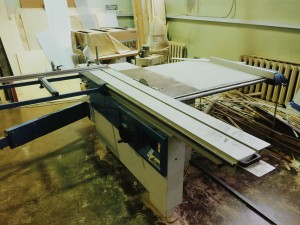
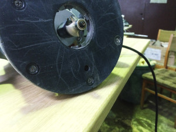
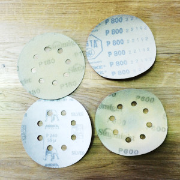
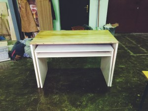
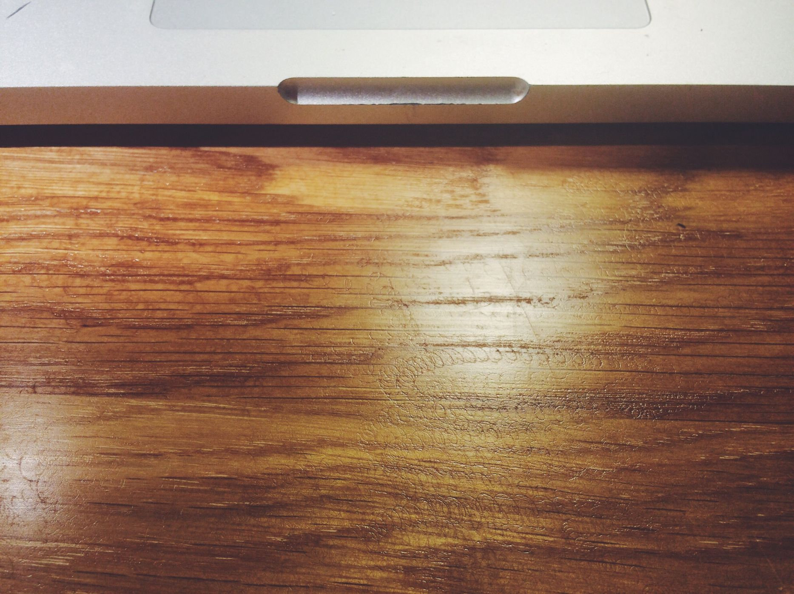

\[su_label type="black" class="class-time fa fa-clock-o"\] 2 недели\[/su_label\]

Стол — один из основных элементов интерьера. Для рисования, проектирования и макетирования хороший рабочий стол — необходимость. Как обычно решаются такие вопросы в наш потребительский век? Конечно же стол можно просто купить в магазине. Однако массово производимая мебель далеко не всегда может удовлетворить всем требованиям. OOLEY предлагает перестать рыться в каталогах и бродить по магазинным галереям, а делать мебель самим. Это не так уж и сложно, особенно когда в городе уже есть общественные мастерские, готовые предоставить помещения и инструменты для работы, а также поделиться опытом и технологиями.

Мы тоже были в шаге от того, чтобы просто купить стол (или даже столы) для нашей комнаты. Мы нашли устраивающий по всем параметрам вариант в одном крупном мебельном интернет-магазине, но при попытке его купить оказалось, что нам прийдётся немного подождать поставки новой партии. Мы оставили заказ и согласились подождать. Эта конструкция из двух столов показалась нам отличным решением, ведь большой стационарный стол может использоваться как письменный, а выезжающий на колесах второй — для раскроя и шитья на машинке, вязания на вязальной машине и для удобной работы над совместными проектами.

Прошла неделя, две, три, вот уже и месяц прошёл и полтора, а стол всё едет и едет и никак не приедет. Всё это время приходилось ютиться за маленьким столиком, с которого постоянно норовили упасть то альбом, то книга, то телефон. Нам это откровенно надоело и появилось понимание того, что мы сможем сделать такой стол сами. И не из ДСП и МДФ как в оригинале, а из полноценного массива дерева. Решено.

Пришлось подождать еще полторы недели новогодних праздников пока не откроется магазин ["Дом дерева"](http://www.domdereva.ru/), где были куплены несколько мебельных щитов разной толщины и размеров: толстые хвойные щиты для ножек и два дубовых щита толщиной **25 мм** для столешниц. Дуб раза в полтора плотнее и тяжелее сосны, солидное дерево. В домашних условиях, конечно, пилить и обрабатывать такие деревяшки непросто — будет очень много стружки и пыли, да и ровно и аккуратно сделать будет трудновато. Поэтому я сразу направился в [производственный коворкинг "Дар труда"](http://ooley.ru/places/dar-truda/ "Дар труда").

Пройдя небольшой инструктаж и сделав несколько пробных отпилов я получил доступ к большому и серьезному **форматно-раскроечному станку**. С его помощью можно быстро и просто отпилить заготовки ровно и в размер с точностью до половины миллиметра. Все привезенные деревяшки я распилил за каких-то \[su_label type="success" class="class-time fa fa-clock-o"\]  20 минут\[/su_label\]. Не зря этот станок — один из самых любимых столярами.

На выходе я получил прямоугольные куски дерева нужного мне размера, теперь нужно было что-то делать с их острыми краями. Острые грани легко сминаются и с них начинает облезать лак. Грани нужно скруглить и для этого идеально подходит **электрический фрезер** с лезвием-фрезой подходящей формы. Пройдя небольшой инструктаж, надев защитные очки и сделав несколько пробных прогонов, я смог овладеть базовой техникой ведения фрезера вдоль края заготовки и скруглил все ненужные углы всего за какие-то \[su_label type="warning" class="class-time fa fa-clock-o"\] пару часов\[/su_label\]. Деталь тщательно прикрепляется к верстаку струбцинами, а инструмент нужно вести вдоль заготовки строго **левой стороной** — так нож врезается в материал и фрезер идёт гладко и без рывков.

Края получились ровными и довольно гладкими, чего нельзя сказать о поверхности самих мебельных щитов. Откровенных щепок из них, конечно, не торчало, но поверхность была еще очень далека от идеала. Настало время шлифовки. Для этого используется **эксцентриковая орбитальная шлифмашинка** и набор различных шлифовальных кругов к ней с разной крупностью, составляющую, как это назвали в мастерской, "пирамидку", т.е. плавное убывание размеров зерна для поэтапного выравнивания поверхности. Чем крупнее зерно, тем меньше цифра, идущая после буквы P в маркировке диска. Сначала крупной шкуркой убираем большие неровности, а затем выравниваем всё более мелкой, получая гладкую поверхность. Для обработки дубовой столешницы нам понадобились круги **P100, P180, P240, P320, P600** и **P800.** Учитывая количество деталей и их поверхностей, шлифовка заняла заняла довольно много времени — \[su_label type="warning" class="class-time fa fa-clock-o"\] 4 часа\[/su_label\]. Еще пришлось использовать круг погрубее, но об этом дальше. А пока шлифовка завершена и пора в покрасочную!

\[su_slider source="media: 1280,1281,1282" link="no" width="720" height="560" title="no" mousewheel="no" autoplay="6000"\]

Да-да, в "Даре труда" есть отдельная покрасочная комната, хоть и расположена она неожиданно далеко — аж на пятом этаже. Поднять наверх доски не составило большого труда благодаря тележке и лифту. Вот со спуском уже было труднее — в тот день лифт заклинило и пришлось ощутить сполна вес столешниц, спуская их по пяти шестиметровым этажам. Покрывать стол мы решили прочным **алкидно-полиуретановым яхтным лаком** в два слоя. Для этих целей нам понадобились:

- колерованный белым пигментом полуматовый яхтный лак,
- кисть с искусственным ворсом,
- мягкий валик и лоток для него,
- полиэтиленовая пленка,
- запас уайт-спирита,
- бумажные полотенца,
- халат,
- респиратор,
- очки.

"Дар труда" активно занимается оборудованием покрасочной комнаты. Теперь там появились несколько шкафов для сушки и больше стеллажей, благодаря уже имеющимся трубопроводам там можно устроить качественную промышленную вытяжку, но в тот момент пришлось ориентироваться в том, что есть. Покрашенные детали я просто прислонял к стенкам, ставя на подпорки из фанеры, а роль вытяжки играло открытое окно — благо с погодой повезло. На улице было чуть выше нуля. Я размышлял просто: в день по слою лака и всё будет готово. Как оказалось с лаком спешить вообще не стоит. Да, **"на отлип"** лак высыхает всего за пару часов. Второй слой через сутки положить можно, но оба слоя после этого будут высыхать, источая целый букет синтетических растворителей, еще примерно \[su_label type="important" class="class-time fa fa-clock-o"\] неделю\[/su_label\]!

Мне не терпелось уже собрать стол и проверить, всё ли выходит как задумано. Для сборки использовались **трапециевидные мебельные стяжки TZ**, по 10 на каждый стол. Благодаря им сверлить или фрезеровать особые отверстия для крепления не понадобилось и конструкция получилась сборно-разборной. Столы получились тяжеленными. И если большой стол оказался вполне устойчивым и крепким, то конструкция нижнего совершенно не выдерживала критики. Одной только полочкой-перемычкой в таком столе не обойтись. Пришлось её распилить и сделать распорку. Колёсики должны приподнять стол ещё на 5 см и распорка не должна сильно мешать ногам. Разбираем всё на детали и везем домой собирать!

\[su_slider source="media: 1284,1285,1286,1288,1289" link="no" width="720" height="560" title="no" mousewheel="no"\]

Ах, как сильно различается восприятие вещей в пространстве огромного цеха мастерской и маленькой комнаты в хрущёвке. С первого же взгляда стало очевидно, что большой стол оказался слишком большим. Затем выяснилось, что площадка креплений имеющихся колёс составляет **38 мм** в то время как толщина ног у маленького стола была всего **28 мм**. Но самое неприятное осознание заключалось в том, что лак продолжает источать крайне неприятные запахи. Столы были решительно разобраны и вынесены на улицу на балкон, где уже через пару дней надвигались серьезные морозы.

Поспешил? Возможно. Если бы доски реально пролежали недельку у открытого окна покрасочной, вполне возможно, что запах бы выветрился. Но я был настроен решительно. **Зачем нужно покрывать живое и натуральное дерево такими едкими синтетическими составами?** И почему я не задался этим вопросом раньше? Ну ничего. В результате изысканий я выяснил, что для обработки дерева идеально подходят натуральные масла и воски, а также их специальные смеси. Для обработки столешниц я взял масло для рабочих поверхностей. Для ножек было решено использовать колерованную белым морилку на водной основе. Вот это уже другое дело! Осталось только снять слои свежего лака и дело за малым.

Снятие лака — весьма трудоемкий процесс. Есть, конечно, специальные смывки, призванные его ускорить, но они оказываются еще более токсичными, чем сами лаки. Нет уж, хватит. Я приобрел металлический шпатель и  шлифовальные диски с самым крупным зерном, которые смог найти в ближайшем магазине — **P40**, разобрал столы и снова повез их в мастерскую. Я уже понимал, что не стоит ожидать мгновенных результатов и настойчиво скрёб и шлифовал детали в сумме часов 8. И пускай это растянулось на два дня, зачистка деталей оказалась все равно быстрее, чем возможное время полного высыхания вонючего лака.

Конечно, я учёл и другой опыт:

- ноги большого стола были чуть уменьшены и теперь столешница выступает над основанием со всех сторон,
- высоту ножек тоже уменьшил до 76 см, что в сумме с толщиной столешницы дало высоту стола в **78,5 см** — чуть выше, чем стандартный письменный стол, но мне так в самый раз,
- маленький стол тоже уменьшился по длине и ширине, а потом мы решили вообще его отложить и сделать для начала только большой.

\[su_slider source="media: 1291,1293,1294,1290" link="no" width="720" height="560" title="no" mousewheel="no" autoplay="7000"\]

Итак, детали подготовлены, поверхности зачищены. Для нанесения масла и морилки уже не требуется отдельного помещения с вытяжкой, это можно сделать и дома. Масло втирается в поверхность тряпкой или полотенцем, по возможности равномерно и без подтёков в три слоя, по слою в \[su_label type="black" class="class-time fa fa-clock-o"\]  сутки\[/su_label\]. Морилка наносится кистью в два слоя с промежуточной сушкой \[su_label type="warning" class="class-time fa fa-clock-o"\] около 5 часов\[/su_label\]. После высыхания первого слоя важно пройтись по поверхности мелкой наждачкой, отшлифовав поднявшиеся от испарения влаги волокна дерева. Финишный слой масла можно отполировать чистой тряпкой через \[su_label type="black" class="class-time fa fa-clock-o"\] 1,5 суток\[/su_label\] после нанесения последнего слоя и всё, стол готов! Сидя за ним я написал эту статью и, надеюсь, это только начало нашего творческого союза. А симпатичные завитки на поверхности, оставленные шлифмашинкой с грубой шкуркой, будут **напоминать о важности тщательного обдумывания каждого шага проекта и внимательности к природе и её возможностям.**

