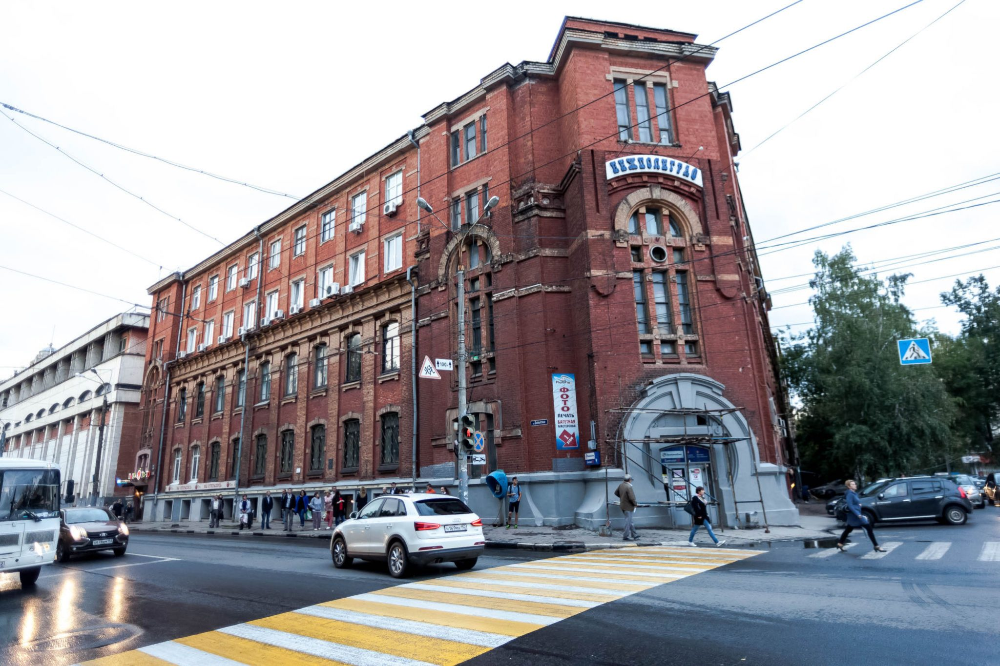
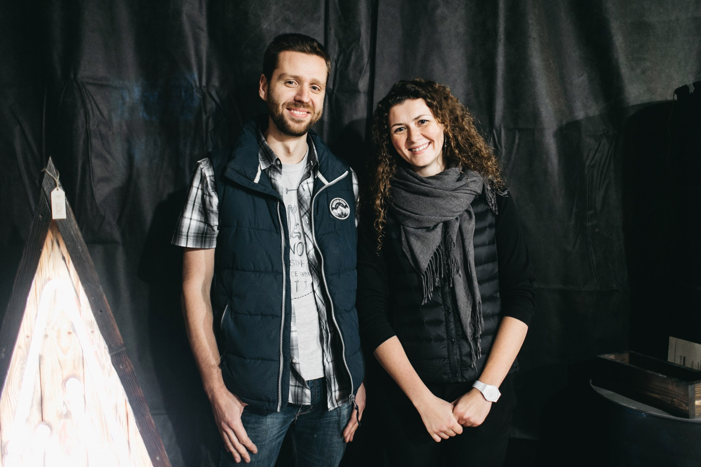

OOLEY собирает и обобщает накопившийся опыт создания и поддержания открытых мастерских в России и мире. Для этого мы посещаем и исследуем такие пространства, общаемся с их командой, собираем истории и делимся наработками. На этот раз мы решили расширить наши познания географически и отправились на родину легендарного изобретателя Кулибина, в Нижний Новгород.

Исторический центр города даже сегодня составлен невысокой жилой и деловой застройкой, здесь много старых деревянных домов, во дворах которых до сих пор сохранились городские садики и неспешная тихая жизнь. Несколько выделяется на этом фоне ближайший к центру города промышленный квартал **Нижполиграфа**, составленный из производственных и офисных построек самых разных времён. Колоритное историческое здание из красного кирпича на ул. Варварская, построено ещё в **1905 году** на месте столярной фабрики. Оно, тогда ещё двухэтажное, поначалу служило «**Домом трудолюбия имени Михаила и Любови Рукавишниковых»**, где сотни нищих находили кров, пищу и несложную занятость. **В 1922 году** сюда свезли печатные станки со всего города — так начинался Нижполиграф, крупнейшая типография в регионе . В дни своего советского расцвета Нижполиграф печатал миллионные тиражи книг и газет, да и сегодня выпускает крупные партии печатной продукции на современных производственных линиях. Современное типографское производство не требует таких значительных площадей, как раньше: многие цеха теперь пустуют. Большая часть пространства старых промышленных зданий сдаётся под фотостудии, офисы турагентств и прочий малый бизнес. Типичная российская «**джентрификация»**. В 2015 году здесь впервые прошёл фестиваль музыки, искусства и технологии «[РезультАрт](http://nn-stories.ru/2015/10/09/resultart/)».

В одном из подвальных помещений комплекса раньше располагалась заводская столярная мастерская. Уже несколько лет назад её заново оживил **Глеб Ковалько**, наладив там производство мебели, элементов декора, а также баланс бордов из фанеры. Дело пошло в гору и места в подвале стало не хватать. Идеи расширения производственного пространства не раз посещали Глеба, но в одиночку тянуть арендную плату за просторный цех в сотню квадратных метров казалось довольно трудной затеей. Идея разделить пространство с другими ремесленниками натолкнула на поиски работающих примеров подобных проектов. Так появился проект **ремесленного коворкинга**, за реализацию которого Глеб взялся в партнёрстве с **Машей Батусовой**. Сначала ребята изучили западный опыт, затем отправились в Санкт-Петербург чтобы вдохновиться опытом реализации одной из самых первых общественных мастерских в России — «[Класса Труда](http://ooley.ru/places/klass-truda/)». Было принято твёрдое решение сделать подобное пространство в Нижнем. Так начиналась «**[Артель](https://vk.com/artel_place)»**.

Около **трёх месяцев** понадобилось команде чтобы оборудовать ремесленный коворкинг в опустевшем **переплётном цехе** на четвёртом этаже исторического корпуса Нижполиграфа. Работы было немало! Отделить стенами столярный цех и перевезти туда уже налаженное производство — уже достаточно масштабное начинание для небольшой команды. А ведь нужно было ещё освободить пространство от **гор мусора** и заделать огромную **дыру в стене**. В процесс подготовки пространства включились не только сотрудники мастерской. На призывы о помощи откликнулись многие жители города, приняв участие в ремонте пространства в качестве **волонтёров**. Совместными усилиями были возведены и красиво оформлены стены столярного цеха, оборудованы системы освещения и вентиляции, обустроена покрасочная камера. Для многих это был интересный опыт творческого сотрудничества, а кто-то даже остался в проекте учиться столярному делу в качестве подмастерья. Цели успеть закончить обустройство мастерской до конца года удалось достичь и **27 декабря** состоялось торжественное открытие первого ремесленного коворкинга в Нижнем Новгороде.

\[su_slider source="media: 5061,5062,5063" width="720" height="360" title="no" mousewheel="no" autoplay="6500" speed="700"\]

Мы следили за развитием «Артели» с самого момента основания, уже в январе разместили точку на нашей карте мастерских и решили однажды обязательно побывать там вживую. Добраться до Нижнего удалось в начале сентября. Войдя в центральный вход исторического здания Нижполиграфа и пройдя прямо до конца коридора, поднимаемся по лестнице на **четвёртый этаж** и попадаем в просторный цех коворкинга. Красиво оформленные деревянные стены столярного цеха — визитная карточка пространства. Здесь использовалась фанера, поддоны и переплётный картон, найденные здесь же во время переезда. Широкие металлические двери ведут внутрь цеха для работы с деревом, а остальное пространство сейчас используется для хранения материалов и творческих проектов различной степени готовности. Это пространство планировалось делить на **отсеки для резидентов** коворкинга, но пока это предложение не нашло достаточного отклика среди нижегородских умельцев. Может быть это из-за того, что культура гаражной и дворовой мастерской здесь все ещё живёт в тихих городских двориках, а может быть люди просто ещё не ощутили в пользу и удобство таких форм сотрудничества. Большинству коворкеров для реализации их проектов пока достаточно доступа к столярке и просторному пространству цеха. Так больше воздуха и свободы.

Глеб и Маша встретили нас у входа и устроили нам небольшую экскурсию по пространству. «Артель» сегодня — просторный светлый зал, открытый для смелых проектов и экспериментов. Здесь есть **грузовой лифт** и **выход на крышу**. Свободного пространства хватит для проведения фестиваля, выставки, концерта. Но нам интереснее то, чем это пространство наполнено в рабочие будни. Слева от входа расположены **шкафчики** для одежды и личных вещей сотрудников и посетителей мастерской. Рядом на поддонах разложены заготовки к проектам резидентов, а чуть дальше, напротив дверей столярного цеха, стоит большой **сборочный стол**. Ещё чуть дальше расположился небольшой столик для чаепитий и перекусов. Вся дальняя часть большого зала нередко используется для проведения общественных ремесленных событий и аукционов, но летом, когда события проводятся как правило на свежем воздухе, здесь образовался стихийный склад всевозможных произведений мастерской и материалов для будущих проектов.

\[su_slider source="media: 5065,5066,5067,5068,5072,5082,5075,5074" width="720" height="360" title="no" mousewheel="no" autoplay="8500" speed="700"\]

На импровизированном складе можно найти много интересного. Здесь лежат, например, большие **чурбаки** спиленного в городе старого тополя — приятный подарок от друзей-альпинистов, занимающихся валкой аварийных деревьев в городе. Здесь есть множество паллет, среди которых, бывает, попадаются экземпляры и из ценных пород дерева, найдутся доски, бруски, фанера, ожидают своей судьбы несколько комплектов мебели. Посередине зала к высокой балке перекрытия подвешены удобные **качели**, собранные полностью из остатков оборудования, найденных в помещениях старых типографских цехов. Вскоре после нашего отъезда ребята навели в этом зале порядок и устроили ремесленный **аукцион**, где выставили на продажу десятки произведений мастерской. Постепенно к команде проекта приходит понимание рациональной планировки и зонирования зала и мы ещё увидим дальнейшие его усовершенствования.

\[su_slider source="media: 5079,5078,5077,5076,5083" width="720" height="360" title="no" mousewheel="no" autoplay="9500" speed="700"\]

Мы специально выбрали для посещения будний день, когда работа в мастерской особенно насыщенна. Неподалёку от входа парни готовят верстак и рабочее место для слесарки и сварки. Многие современные дизайн производства не мыслят себя без сочетания живого тёплого дерева с прочными и в то же время визуально лёгкими металлическими каркасами. На сборочном столе склеивается очередной наборный щит, коворкеры трудятся над своими проектами. За широкими железными дверьми столярного цеха шумят вытяжки и электроинструменты. Не терпится получше изучить наполнение основного производственного помещения мастерской.

\[su_slider source="media: 5088,5089,5090,5091,5092,5093,5094,5095,5096,5097,5098,5100,5104" width="720" height="360" title="no" mousewheel="no" autoplay="7000" speed="700"\]

Помещение столярного цеха освещается приятным тёплым светом дюжины направленных студийных прожекторов, создающих ощущение уюта и некоторой театральности. Представление в самом разгаре: сотрудники и резиденты мастерской увлечённо трудятся над своими проектами. Вдоль стен здесь установлены стеллажи для хранения запасов древесины, в углах зала отделены небольшие специальные помещения, а вся центральная часть цеха отведена для станков. Рабочие верстаки размещены вдоль окон под цепочкой ламп дополнительного освещения. На полках можно найти разнообразные ручные **электроинструменты**: от шуруповёртов и лобзиков до шлифмашинок всех видов и калибров. Для грубого распила заготовок есть **циркулярный станок**, а для более точных резов здесь на специальном столе используется **погружная пила** с длинной шиной. Посреди зала стоит массивный советский **фуганок** — наследие столярной мастерской Нижполиграфа. Есть **торцовочная пила**, **рейсмус**, **компрессор** и не один. Всё это оборудование доступно для использования коворкерами.

\[su_slider source="media: 5099,5101,5102,5103,5105" width="720" height="360" title="no" mousewheel="no" autoplay="9000" speed="700"\]

Отдельные условия доступа предусмотрены к **ЧПУ-фрезерам**, которых здесь целых два: небольшой настольный и крупноформатный промышленный станок, принадлежащий одному из резидентов мастерской. В небольшой комнате, отделённой невысокой стеной от основного зала, установлен **лазерный резак**, а в помещении в противоположной части цеха обустроена полноценная **покрасочная камера**. Внутри неё размещён удобный **стол с вытяжкой**, стеллаж из **консолей** для сушки изделий. Есть различные краски и пропитки, несколько **краскопультов**, подключающихся к отдельному **компрессору**. Обустроена хорошая приточная и вытяжная вентиляция.

Даже такой парк оборудования позволяет создавать большой ассортимент столярной продукции. На базе «Артели» развивается сразу несколько производственных проектов, занимающихся созданием мебели и предметов интерьера для кафе и ресторанов, изготовлением баланс бордов и не только. Гибкое пространство цеха позволяет мастерской трансформироваться под самые неожиданные форматы использования. Здесь, бывает, печатают методом шелкографии, паяют стеклянные аквариумы и режут вручную деревянные ложки. Многие горожане с радостью посещают многообразные мастер-классы и презентации и каждый по-своему обдумывают перспективы сотрудничества с новым необычным пространством. Летний сезон разъездов и фестивалей заканчивается и, наверняка, многие умельцы найдут в «Артели» уютный зимний дом для своих творческих начинаний. Сочетая работу с заказами, предоставление рабочих мест в коворкинге и продажу дизайн-изделий на ярмарках и аукционах, первый нижегородский ремесленный коворкинг постепенно находит свою собственную уникальную модель устойчивой работы и развития. Мы поделились с Машей и Глебом нашими идеями и наработками в этой сфере, подарили им по экземпляру нашего [«Руководства».](http://ooley.ru/theory/handbook/) Будем и дальше внимательно следить за развитием этого уникального для Нижнего Новгорода проекта.
