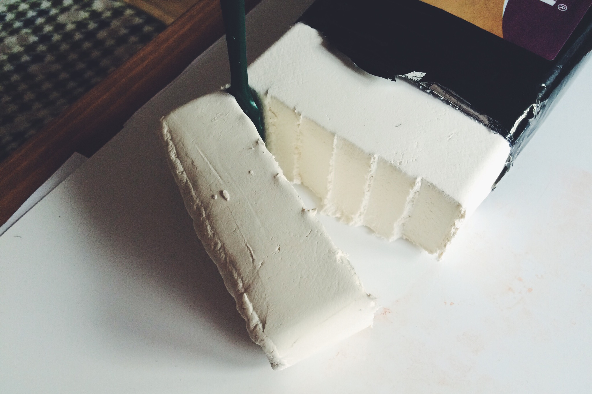
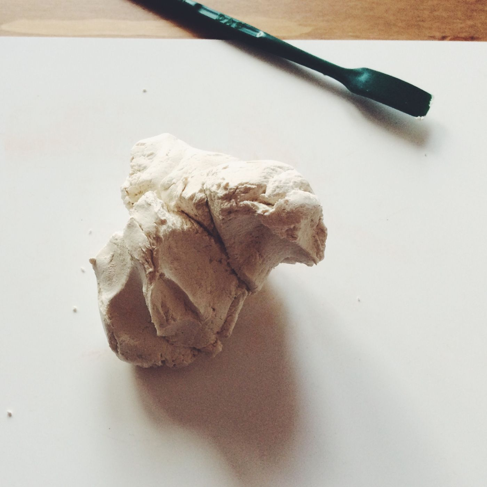
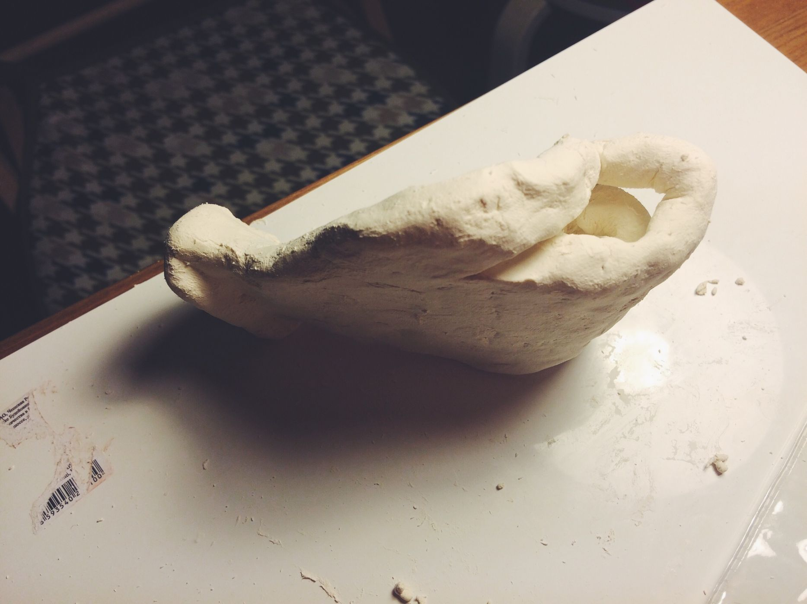

Сегодня на рынке представлено довольно большое количество разнообразных материалов для лепки и моделирования, от обычного пластилина и старой доброй глины до сложных композиций полимерных глин и пластики.  Эти материалы довольно сильно различаются в свойствах, возможностях обработки и стоимости.

Как лепить из пластилина знает, пожалуй, каждый. Просто оторви кусок и мни пока не получишь желаемую форму. Некоторых усилий может потребовать овладение стеками и другим инструментом для лепки, но сам материал позволяет экспериментировать и практиковаться практически неограниченно.

Сложнее становится, когда вы хотите получить что-то готовое, твердое и держащее форму. Самым надежным и проверенным способом является лепка из глины с её последующей сушкой и обжигом, но это долгий и сложный процесс, требующий наличия полноценной печи для обжига керамики, позволяющей достичь температур почти в **1000°C.** Для тех, у кого нет столько времени и доступа к муфельной печи, и существуют различные виды модельных масс и паст. Мы решили изучить эту достаточно новую сферу материалов и познакомить вас с ними.

Первым испытуемым стала модельная масса **DARWI ROC**, купленная в ближайшем крупном магазине для творчества. Килограммовая упаковка обошлась нам примерно в **300 рублей**. Давайте попробуем её в действии!

Аккуратно открываем пакет, стараясь предусмотреть возможность потом его герметично закрыть. Используя нож или стек, отделяем нужное количество материала и закупориваем пакет, используя кусочек липкой ленты.

Материал на ощупь слегка зернистый, похож на суховатое тесто. Его можно катать и лепить, но не ждите от него такой же пластичности и "слепляемости", как у пластилина. На первый взгляд масса вообще кажется малопригодной для лепки.

]

Её главным секретом является то, что она становится намного более податливой и слепляющейся, если слегка намочить руки перед работой и периодически добавлять по чуть-чуть во время лепки. Но смотрите не переусердствуйте! Воды нужно совсем немного, иначе материал начинает буквально растворяться. Лучшим способом будет поставить где-то рядом миску с водой и, при необходимости, окунать туда пальцы.

Постепенно можно освоиться с режимом смачивания массы и создавать довольно сложные формы, в особенности если использовать различные инструменты и подручные средства, начиная со стеков для лепки и различных резцов для работы с тонкими формами и фактурой поверхности и заканчивая зубочистками и ниткой для создания углублений и текстуры.

Время высыхания массы определяется как **1 см** вглубь за **24 часа** сушки. Т.е. чем форма толще и плотнее, тем дольше она будет сохнуть.  Полностью высохшая, масса очень похожа на гипс и её можно обрабатывать множеством различных способов: шлифовать наждачкой, полировать тряпочкой, процарапывать резцами.

В целом материал вполне пригоден для изготовления небольших поделок, скульптуры и даже архитектурного моделирования.

P.S.: Мы нашли видео с демонстрацией работы с массой DARWI ROC при создании авторской куклы. Видны основные технические азы. Пробуйте!

