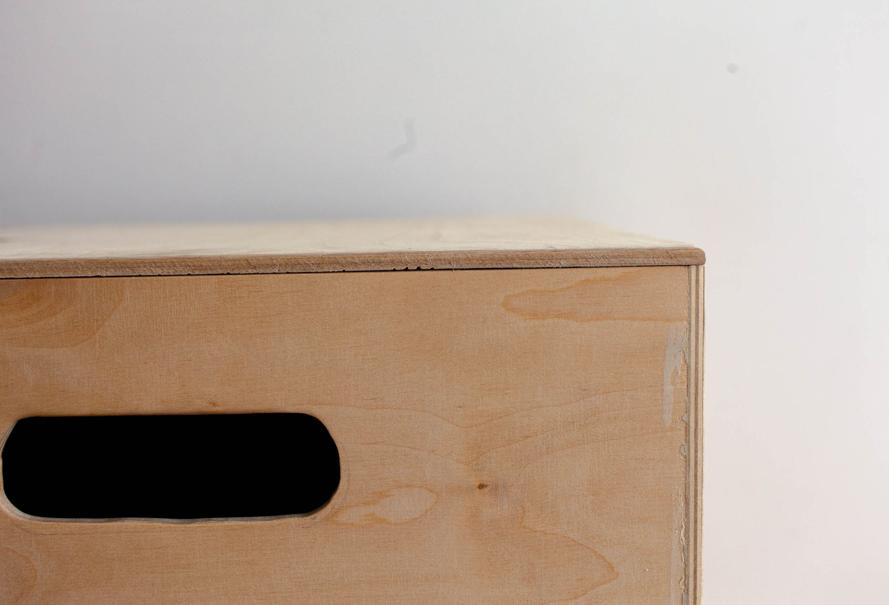
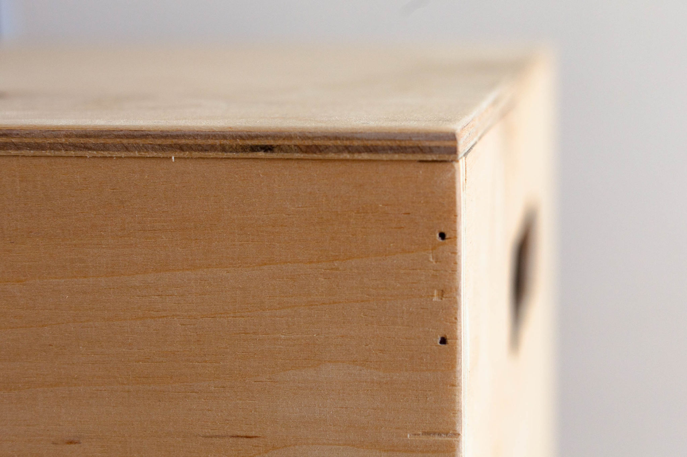
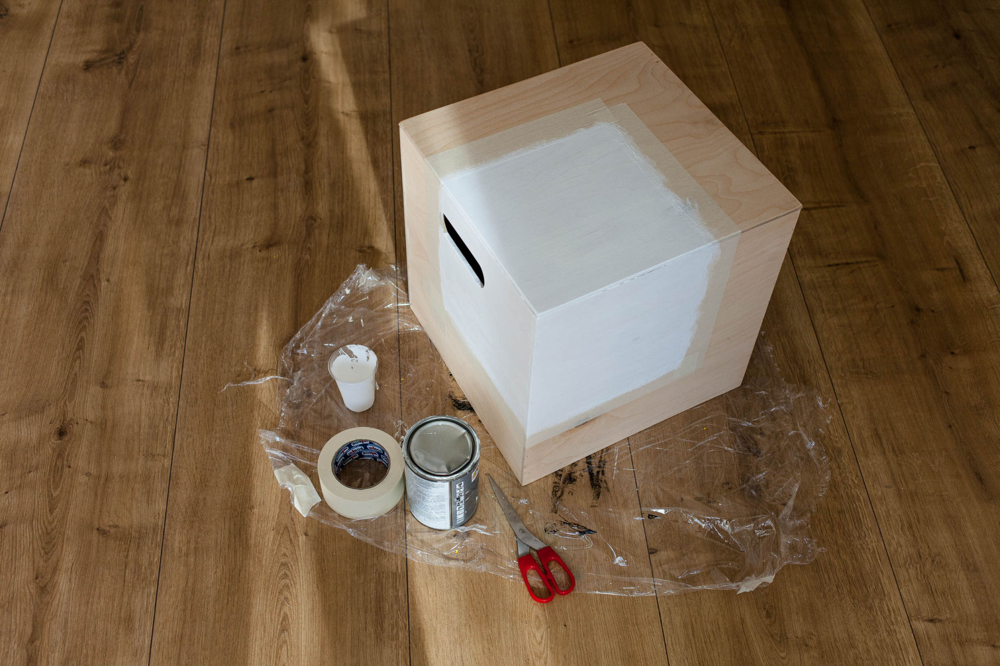
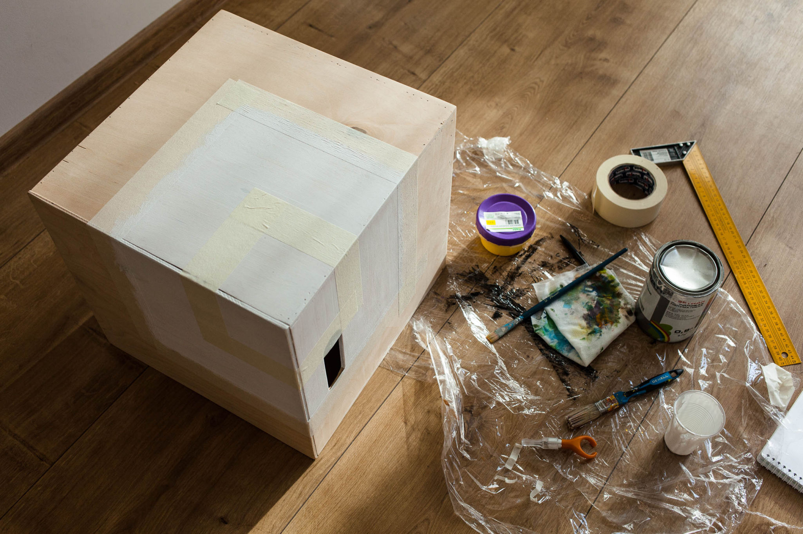
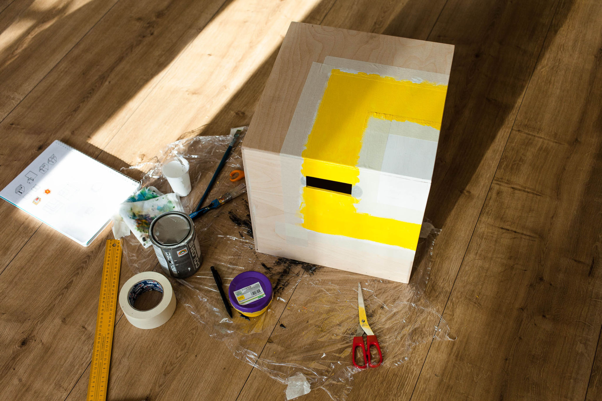
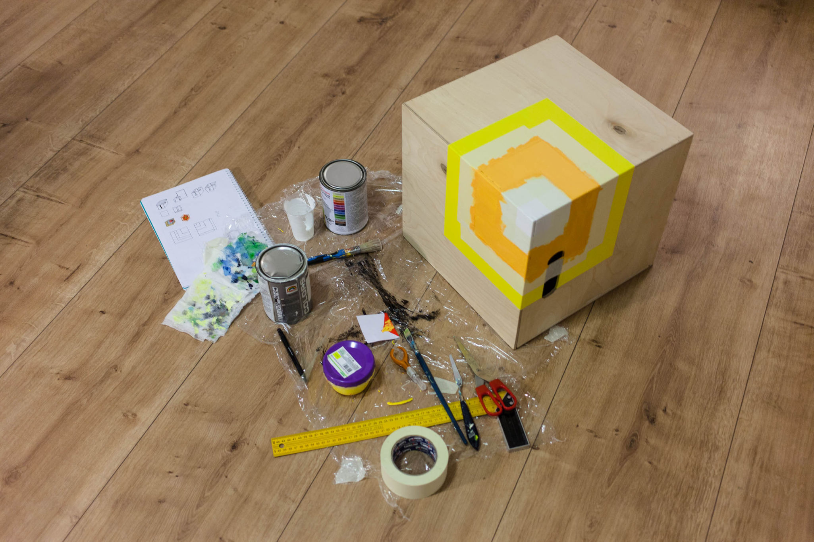
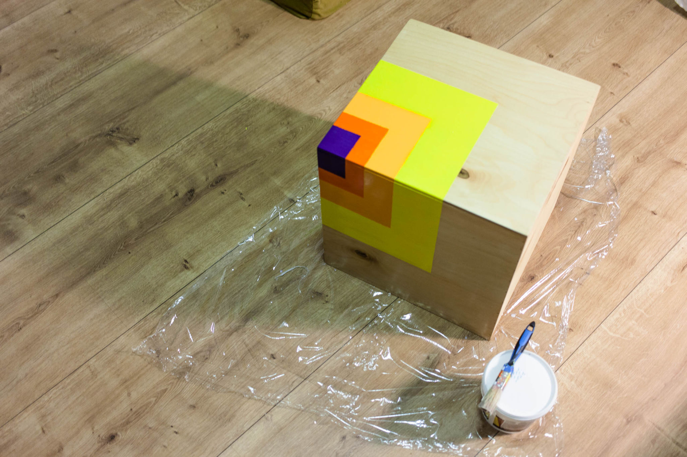
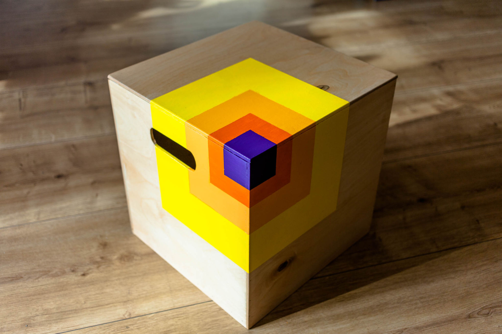
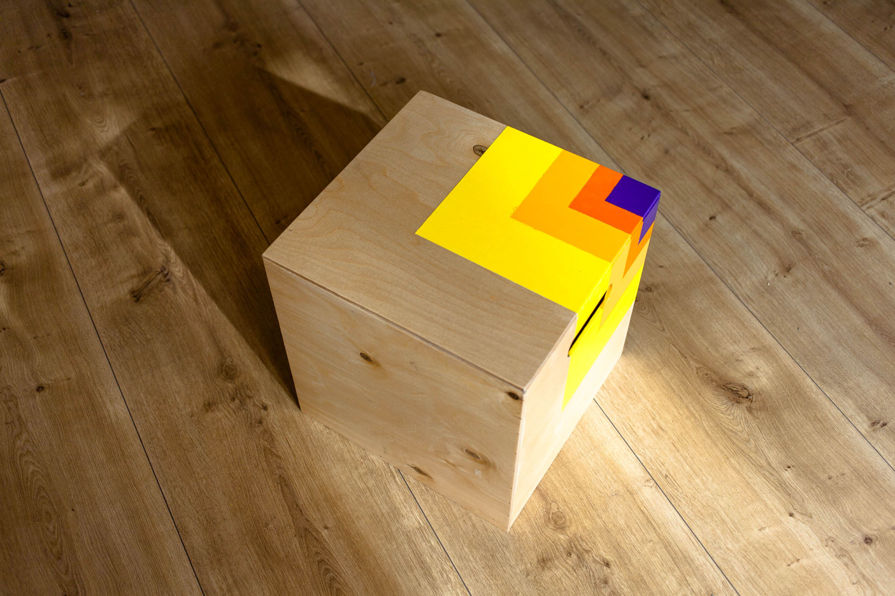

Мы продолжаем постигать азы столярного дела, придумывая и реализуя разнообразные проекты. Создание **ящиков и ящичков** самых разных размеров — одна из основных столярных задач. Мы с интересом изучили десятки обучающих видеороликов, прочитали несколько статей о самых разных видах столярных соединений, сделали несколько макетов из скотча и картона. Как оказалось, даже базовые задачи далеко не всегда имеют тривиальные решения. Ничего, мы во всём разобрались и сделали лаконичный ящик из тонкой фанеры — прототип будущей ограниченной серии. Знакомьтесь, **"Куб-сундук 1.0"**!

Перед нами стоял первоочередной вопрос: насколько тонкими можно сделать стенки фанерного ящика без потери прочности стенок и угловых соединений? Слишком тонкие листы невозможно скрепить под прямым углом друг с другом и понадобится устройство внутреннего каркаса, который сделает всю конструкцию сложной и громоздкой. Слишком толстая фанера сделает ящик тяжёлым, а также съест много внутреннего пространства ящика, особенно небольшого. На тонкую фанеру не закрепишь уголок, саморезы разорвут её вдоль слоёв, а для склейки не хватит площади соприкосновения.

Наши изыскания привели нас к компромиссной толщине листа в **6 мм**. Ещё довольно лёгкая, такая фанера уже имеет достаточную прочность и упругость. В такой фанере уже можно проделать фрезером паз для дна на глубину **3 мм**, а её торец позволяет эффективно использовать **клей и небольшие гвозди** для соединения стенок. Навыки работы с **циркулярной пилой** и **ручным фрезером** позволяют сделать ящик ровным и аккуратным. Крышка снимается и устанавливается ровно на своё место за счёт **небольших накладок внутри** по углам. Сейчас мы ищем способы прикрепить к такой фанере петли и сделать крышку **откидной**.

Шлифованая фанера — отличная поверхность для **акриловой краски и лака**. Для нанесения несложного, но эффектного рисунка сначала обклеиваем его границы **малярным скотчем** и **грунтуем** поверхность слегка разбавленной **белой краской**. Такая подложка сделает краски яркими и насыщенными, а поверхность рисунка гладкой и однородной. Отделяя зону каждого цвета малярным скотчем, наносим предварительно смешанные акриловые краски в **два слоя**. Для ускорения процесса сушки используем **технический фен**. [Как хорошо использовать водорастворимые акриловые краски](/theory/research/oda-akrilu/) — никакого неприятного запаха и никаких специальных средств для их нанесения не требуется. После высыхания всех цветов ещё раз очищаем ящик от пыли, оставшейся после шлифования и тщательно покрываем снаружи и изнутри **глянцевым акриловым лаком**. Чтобы ящик было удобно двигать по полу, наклеиваем на его нижние грани **войлочные накладки**. Готово!

Наш прототип **"Куб-сундук 1.0"** мы сделали размером **38х38х38 сантиметров**, что оказалось очень удобным для сидения и он быстро нашёл своё место в квартире. Внутри хранятся разные мешки, сумки и запас ткани для шитья, а сверху удобно размещается небольшая подушка, превращающая ящик в **лаконичное сиденье**. Теоретически, "Куб-сундук" можно сделать намного меньше и немного больше: **от 10х10х10 см до**, примерно, **50х50х50**. Для более крупных ящиков стоит применять фанеру потолще и, возможно, гвоздики заменить на саморезы или иной крепёж. Если сделать "Куб-сундук" чуть более вытянутым и просверлить в нём побольше вентиляционных отверстий, он может стать отличным **ящиком для белья**, а оснащённый петлями и отверстием для замка может стать удобной **ячейкой для хранения личных вещей в хостеле, коворкинге или открытой мастерской**. Производственная технология оказалось довольно простой и поддающейся значительной оптимизации, так что в скором времени надеемся расширить эту серию и дать возможность вам не только **приобрести свой "Куб-сундук"**, но и **сделать такой ящик своими руками**.
