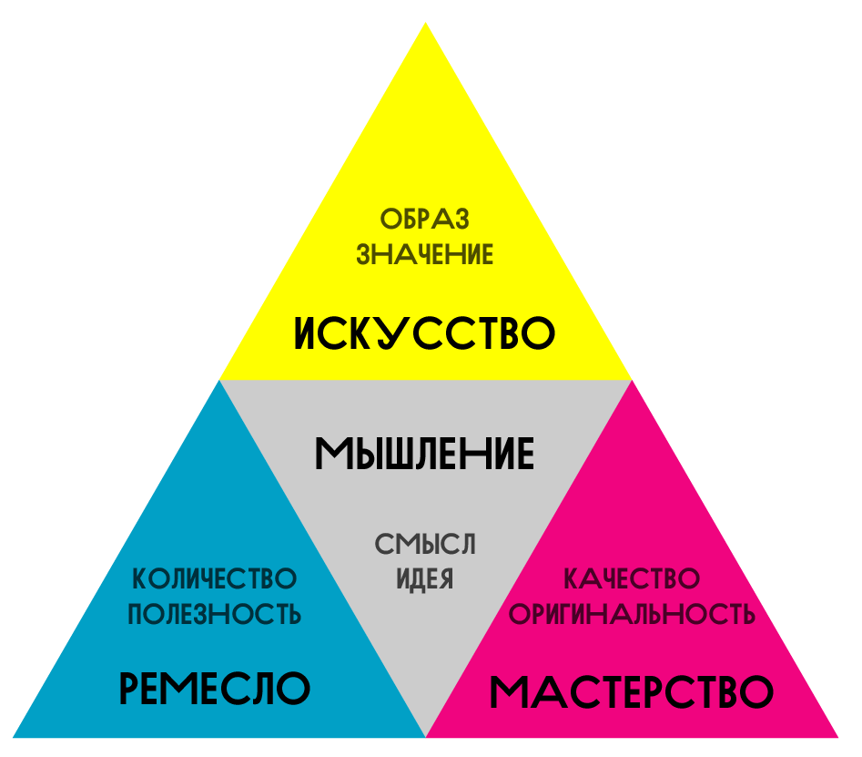
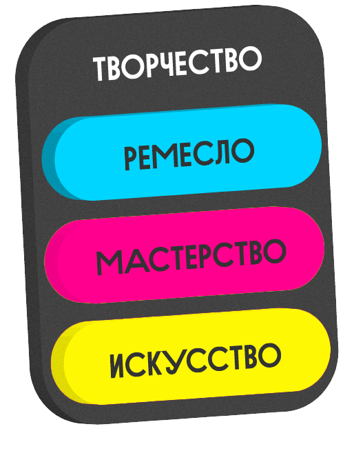

Эпоха массового производства и потребления принесла в жизни людей невиданный ранее выбор товаров и комфорт. Широкий доступ к благам механизации и автоматизации значительно повлиял практически на все сферы нашей жизни. Непрерывный процесс развития и внедрения новых технологий буквально завораживает. Порой может показаться, что массовое промышленное тиражирование материальных и духовных ценностей способно удовлетворить любые потребности человека. Но человек нуждается не только в потреблении.

Способность осознанно создавать предметы — ключевое эволюционное преимущество человека разумного. Именно возможность трансформировать окружающую среду силой воображения и собственными руками позволила человечеству распространиться по всей Земле и даже за её пределы. Творить — это не просто возможность, это жизненная необходимость для нас как для вида. Изучать и выражать себя нам нужно не меньше, чем есть или спать.

**Творчество** — это осознанное совершенствование окружающего мира. Это создание чего-то нового и ценного не только для автора, но и для кого-то ещё. Каждый раз, самостоятельно реализуя желаемые изменения в действительности, человек неизбежно вкладывает в процесс частицу себя. Это придает результатам такой деятельности уникальность и особую ценность.

Обращаясь к творчеству как с средству самоизучения и самовыражения, человек может обнаружить перед собой необъятные просторы самых различных возможностей. В творчестве помимо технического, художественного или, к примеру, музыкального выделяют ещё множество других направлений: научное, изобретательское, социальное, педагогическое, культурное, организаторское, предпринимательское, философское или игровое направление. Не говоря о спортивном, мифологическом, религиозном, правовом, политическом и повседневно-бытовом творчестве.

Каждый может найти самый подходящий именно для него способ изучать себя и мир, а также делиться с другими тем, что узнал. Человек испытывает подлинную радость, раскрывая собственный потенциал в интересующем его направлении. С освоением технологий, накапливается живой практический опыт, постепенно меняется восприятие выбранной сферы деятельности и себя в ней.

Всё начинается с накопления знаний и опыта для того, чтобы сделать хоть что-то. Читать, смотреть, слушать и запоминать. Ставить эксперименты и размышлять над их последствиями. Первые шаги редко приносят ощутимый результат: каждый умелец знает, сколько проб и ошибок нужно совершить прежде, чем закончишь произведение, которым сможешь гордиться. С практикой приходит понимание и чёткость действий, начинают получаться всё более предсказуемые результаты, происходит проникновение человека в выбранное **ремесло**.

Степень погружения в то или иное направление значительно влияет на весь творческий процесс и его результаты. Освоив пусть и небольшой, но действенный набор технологических приёмов, практически каждый способен серийно производить самые разнообразные вещи. Сначала в малом масштабе, своими руками, для близких и друзей. Нередко увлечение развивается затем в рыночный бренд с командой сотрудников и широкой базой клиентов. Работая на заказ или на рынок, ремесленник создаёт полезные людям вещи. Больше заказов или проданных товаров — больше оборот и доход. По мере налаживания и поддержания производственного процесса, ремесленник-предприниматель накапливает большой объем опыта и ресурсов, что даёт ему значительные творческие возможности в выбранном направлении.

Углубляясь в то или иное направление, мы, как правило, начинаем всё больше уделять внимания качеству создаваемых вещей. Постепенно совершенствуя свои умения, человек обретает **мастерство**. Мастера отличает глубокое понимание предмета, способность находить оптимальные решения даже очень сложных задач, а также наличие возможностей для их реализации. Надежные инструменты и отточенные умения позволяют мастеру получать радость от детальной проработки каждого аспекта изделия. Его оригинальность и значительность выходят на первый план. Виртуозность и общественное признание для мастера может быть куда важнее, чем количество или полезность производимых им изделий.

> Изучение ремесел открывает для человека новые возможности самопознания и самореализации. Вдумчивое созидание помогает нам лучше понять себя и окружающий мир.

Когда по мере погружения в творчество эстетика и выразительность произведения становятся для нас важнее его практической пользы и оценочной стоимости, мы вступаем на территорию **искусства**. Изобразить то, что чувствуешь и считаешь важным, обратить внимание на то или иное — для автора важно заложить в своё произведение ценный смысл, который вызовет живой отклик у его аудитории. Искусство раз за разом позволяет по-новому взглянуть на себя и на мир, а также разделить свое видение с окружающими. Человек способен выражать и распознавать самые различные идеи и смыслы в самых разнообразных формах. Воплощение вдохновения в произведениях и наслаждение выразительностью и совершенством в творениях других — практически неиссякаемые источники подлинной радости.

Можно рассматривать ремесло, мастерство и искусство как ступени погружения человека в творчество. Но это совсем не значит, что это единственный путь. Каждому человеку в каждом отдельном творческом направлении в разное время может становиться ближе любая из этих степеней. Бывает так, что умелец настолько овладевает мастерством, что начинает вкладывать смыслы и значения в свои произведения. Бывает и наоборот, когда удачное произведение искусства сначала мастерски копируют, а затем массово тиражируют многочисленные ремесленники. Даже овладев мастерством в одной области, новые направления человеку приходится изучать практически с нуля.

Мы определили три ключевые области на шкале проникновения человека в искусство самовыражения. Но не стоит забывать, что сфера творчества безгранична и способна раз за разом приносить ценный опыт и радость самореализации вне зависимости от выбранного направления и уровня проникновения. Ремесло может стать не только приятным хобби, но и интересным производственным предпринимательством. Мастерство приносит человеку спокойствие и уверенность в ценности того, что он делает. А искусство открывает душу, позволяя ей тонко взаимодействовать с собой и окружающими. Для всякой задачи найдётся подходящее средство. Ведь всё это — грани единого процесса реализации творческих стремлений человека.

Практическое исследование окружающего мира и поиск способов выражения его совершенства — наше общее внутреннее чувство, которое руководит человечеством с самых древних времён. Нами движет стремление познать себя и мир, а также выразить всё то, что понял за краткий миг жизни. Быть понятым, делать благо, проявлять истину снаружи и внутри. Развиваться, реализоваться и обрести себя. А что потом?

Остановиться, смолкнуть и увидеть всё во всём. Созерцать весь мир как бескрайнее творческое пространство, где каждому найдётся место. Спокойно наблюдать за колебаниями баланса между производством и потреблением, радостью и устремлениями, жизнью и представлениями о ней. Творчество — ключевой этап на пути человеческой самореализации.

