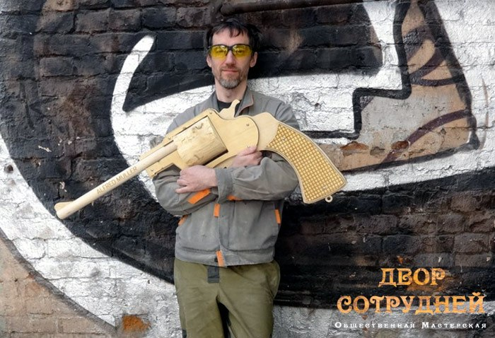

**Общественная мастерская** (далее **ОМ**) - вещь средняя между рыбой и мясом (может быть птица?) в том плане что это не бизнес и не полностью социальный проект. Поэтому, для того чтобы она работала, нужно уметь сочетать как деловые, так и общественно-полезные интересы.

Первое что нужно сделать - собрать команду, нам очень повезло у нас такая команда была, потом некоторые отошли в сторону, но большинство наших активных участников и первооткрывателей до сих пор с нами. Вместе с этим, думаю, критически важно, чтобы был один человек, которые принимает все окончательные решения и несет на себе основной груз ответственности.

Второе - выбрать основные направления работы, их может быть несколько: а) Предоставление рабочих мест в аренду. б) Обучение и мастер-классы. в) Оказание услуг населению по мелким работам (распил, сверление и тд) г) Работа по заказам.

Когда мы только начинали, мы планировали что предоставление рабочих мест в почасовую аренду будет основным видом нашей деятельности, отчасти это было продиктовано тем, что рядом с нами работало 2 антикафе, где повременная оплата пользуется неплохим спросом. Но, как сказал один американский коллега - очень маленький процент людей просыпается с желанием сделать табуретку своими руками. Первые несколько месяцев были довольно тяжелыми, так как коммерческую аренду, на которой мы сидели, отбивать не получалось, приходилось совмещать основную работу с развитием мастерской, что не давало особого успеха ни там ни там. Думаю, стоит просчитывать минимум полгода на запас по возможности работать ниже уровня самоокупаемости хотя бы по аренде. За это время пропадает первичный энтузиазм и тут самое главное не впасть в грех уныния и продолжать работать, не смотря ни на что. Надо верить - общественная мастерская дело благое, за него и потерпеть немножко можно, Господь дарует возможность упорным. За это время мы выяснили что бОльшей популярностью (в денежном выражении) пользуется помесячный вариант оплаты. Как правило, люди, заинтересованные в таком подходе - начинающие мастера, которым надоела их прежняя (зачастую офисная) работа и они хотят делать нечто более материально осязаемое. Это новое явление в нашем обществе, целый новый класс и он будет обязательно расти и шириться.

Обучение никогда не было нашим сильным коньком, так как для этого необходимо выстраивать целую структуру. Хотя мы обучили и продолжаем обучать большое количество людей. В Москве существует ряд довольно известных в столярном деле людей, которые проводят обучение на более высоком уровне, мы не ставим своей задачей конкурировать с ними, наша цель - дать человеку базовые навыки по работе на различном оборудовании и помочь ему отправиться в свободное плавание. Огромный бонус **ОМ** состоит в том, что здесь происходит активный и постоянный процесс обмена опытом. Сюда, как правило, тянутся люди общественно активные, готовые учиться и делиться своим опытом. Для мастер-классов стоит сразу найти преподавателей которые могут не просто делиться своими знаниями, но и способны сами набирать и вести группы, а задача **ОМ** - оказывать им общую информационную поддержку через свои ресурсы. Наше помещение небольшое (основной зал со станками на сегодняшний день 30 кв. м.), что не позволяет часто проводить мастер-классы, но стараемся это регулярно делать, так как это очень здорово помогает нам самим. Я знаю, что другие мастерские, в частности питерский Класс Труда больше специализируется как раз обучении и проведение мастер-классов. Наша специализация несколько другая, мы нацелены на тех, кто по стремится расти по выбранному направлению более профессионально.

Оказание небольших услуг это способ улучшения отношений с окружающей средой. Для небольших городов, думаю, это будет неплохим плюсом в бюджет мастерской, услуги могут быть самые вплоть до небольшой резки стекла и изготовления ключей.

Работа по заказам приносила и приносит самый большой процент дохода и позволяет нашей мастерской развиваться далее. Считаю также что работа по заказам дает постоянную необходимость профессионального роста наших сотрудней, повышения уровня материально-технического оснащения мастерской, улучшения взаимодействия между различными отделами. У немного сотрудников в штате, наша мастерская выступает как агрегатор заказов, которые мы потом передаем нашим сотрудням, т.е. мастерам, арендующим рабочие места на постоянной либо временной основе, таким образом осуществляется основа работы в ОМ. Выполняя заказы, мы помогаем друг другу, не создавая громоздких управленческих структур.

Для нас самым интересным опытом является опыт практического взаимодействия самостоятельных мастеров под единой крышей "[Двора Сотрудней](/workshop/tour/dvor-sotrudnej/ "Двор сотрудней")". Это общественный эксперимент, мы нащупываем новые возможности экономической, производственной и межличностной организации труда. Тут не обойтись без ошибок, но ведь мы в самом начале нового пути.

Автор: [Константин Скворцов](https://vk.com/skvorenze)
