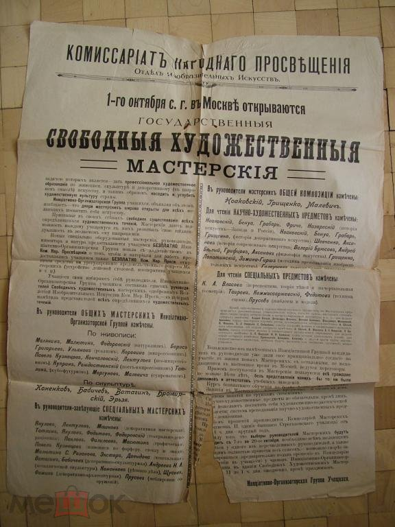
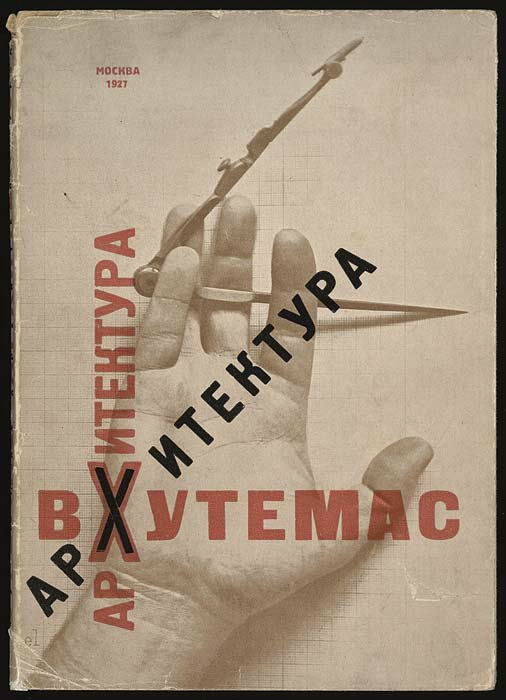
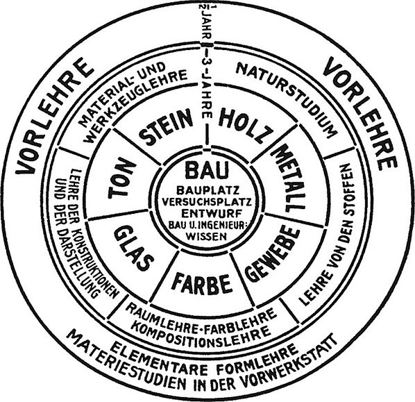
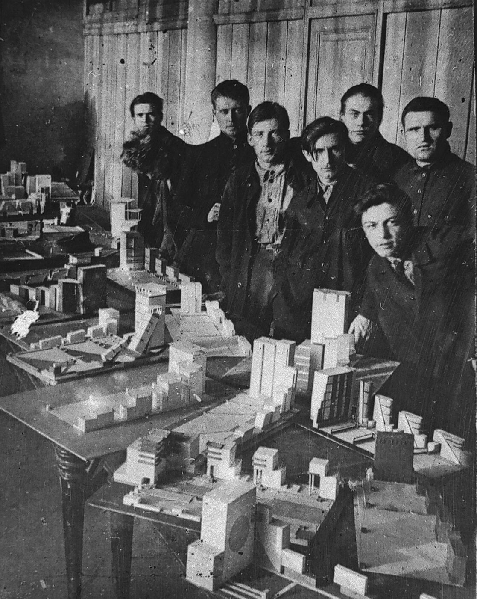
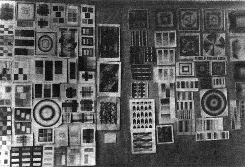
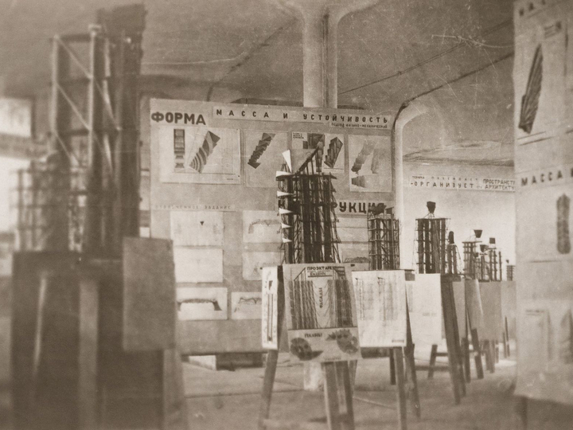

В 2019—2020-х годах мир празднует столетие образования двух революционных школ, стоящих у истоков дизайна как самостоятельного направления человеческой деятельности. Век назад на стыке искусства и ремесла происходил удивительный процесс синтеза. Творческие профессии очищались от рамок традиций прошлого и становились авангардом развития промышленного производства. Отвергнув готовые ответы, исследователи и экспериментаторы самостоятельно обнаруживали и использовали как естественные законы природы, так и фундаментальные принципы человеческого восприятия.

### Освобождение искусств

Сердцем революционных движений на рубеже XIX и XX веков были стихийно возникающие союзы рабочих самых разных отраслей. Большие группы людей, объединенные схожим социальным положением и общими интересами, устраивали собрания, избирали представителей и учреждали независимые организации, служившие органами принятия и реализации коллективных решений. Тред-юнионы и синдикаты, профсоюзы и комитеты делегатов стали инструментом высвобождения рабочих и крестьян от жестокой эксплуатации по всему миру.

Собрания рабочих выбирали и выдвигали своих депутатов как для представительства в переговорах с администрацией, так и для формирования более крупных объединений. Именно таким вновь возникающим в народе демократическим структурам призвали передать власть в ходе Октябрьской революции 1917 года большевики. Дух освобождения и творческого самоопределения пронизывал в то время все общество.

В апреле 1918 года в Москве и Петрограде состоялась «Конференция учащих и учащихся искусству», на которой студенты Императорской Академии художеств в Петрограде и Московского училища живописи, ваяния и зодчества потребовали «свободы искусства» и выборов руководителей творческих мастерских. К тому времени все учебные заведения перешли в ведение Наркомпроса (Народного комиссариата просвещения). Учащимися были организованы выборы руководителей Свободных государственных художественных мастерских (СГХМ). Поступить в них мог любой желающий, достигший 16 лет, без конкурса и образования.

На смену застывшему в своем развитии академическому искусству пришли новые представления о творческом потенциале человека. Вторая технологическая революция на рубеже веков предопределила тектонические сдвиги в культуре. Человечество в короткие сроки овладело множеством способов преобразования окружающего мира, что открыло перед людьми невероятные новые горизонты возможностей. Неподдельный интерес людей к производству сочетался с огромной потребностью в его творческом осмыслении. Стремление осваивать и совместно совершенствовать все новые способы преобразования мира сближало художников с рабочими, а искусство с промышленностью.

Модернизм повсеместно сметал старые нормы и открывал доселе невиданные пространства самовыражения и самореализации человека. Свободные мастерские стали пространством для высвобождения творческой мысли человека, площадкой для смелых экспериментов авангарда. Это было пространство живого поиска, которое позволило раскрыться множеству новых имен и направлений в искусстве.

### Между искусством и производством

Эмансипированное пролетарское общество и формирующееся новое государство требовало придать творческому поиску структуру. С одной стороны сами учащиеся требовали четких программ и единых принципов обучения. С другой стороны в кругах педагогов-авангардистов в противовес идее абсолютной творческой свободы индивида всё больше укреплялись идеи объективности законов формообразования. В основу новой художественной педагогики были положены методы аналитического исследования художественной формы, рождённые в творческом эксперименте авангардистов. Третьей причиной перестройки Свободных мастерских стала необходимость создания художественных кадров для промышленности.

В 19 декабря 1920 года Первые и Вторые СГХМ (бывшие Императорское Строгановское Центральное художественно-промышленное училище и Училище живописи, ваяния и зодчества) были объединены и преобразованы в Высшие Художественно-творческие мастерские — ВХУТЕМАС под руководством выборной коллегии из 5 человек. В новом учебном заведении были образованы восемь факультетов: архитектурный, художественные (живописный, скульптурный) и производственные (полиграфический, текстильный, керамический, деревообделочный и металлообрабатывающий).

Схожие преобразования произошли в это время в Германии. 19 апреля 1919 года в результате объединения Высшей школы изобразительных искусств и школы прикладного искусства была образована школа Баухаус, навсегда изменившая представление о творческом потенциале человека.

> Мир рисовальщиков, чертежников, ремесленников должен, наконец, снова стать миром зодчих. Если молодой человек, чувствующий призвание к творчеству и мнящий себя «художником», начнет свою карьеру так же, как некогда, с изучения азов ремесла, он уже не будет обречен на убогое подражательство и копирование, ибо его одаренность сохранится в ремесле, где он научится создавать нечто великолепное.
>
> Архитекторы, скульпторы, живописцы — все мы должны вернуться к ремеслу. Ибо нет такой профессии — «искусство». Нет существенного различия между художником и ремесленником. Художник — тот же ремесленник высокого класса. В редкие моменты озарения, помимо нашей воли, на нас нисходит небесная благодать, преображающая дело рук мастера в искусство, но любой художник непременно должен владеть основами ремесла.
>
> Так давайте же создадим новый цех ремесленников без табели о рангах, которая воздвигала бы стену высокомерия между художниками и ремесленниками! Давайте придумаем и построим новое здание будущего, где в едином облике выступит всё — архитектура, ваяние и живопись. И когда-нибудь миллионы рук ремесленников поднимут к небу хрустальный символ новой грядущей веры.
>
> — Манифест «Баухаус», _Вальтер Гропиус_

Именно в этот период как синтез искусства и промышленного производства возникало новое направление человеческой деятельности — дизайн. Творческие способности человека нашли рациональное применение во множестве отраслей. Ранние теоретики и экспериментаторы обратились к архитектуре как к синтезу прикладного и изобразительного искусства, а затем на практике обнаружили универсальные принципы создания вещей, формирующих окружающую нас реальность.

### От конструктивизма к дизайну

Появление и развитие конструктивизма в полной мере обусловлено социально-историческими предпосылками, социокультурным и идеологическим контекстом начала XX в. Он становится выразителем новых веяний, катализатором революционных идей и преобразований, затрагивающих все сферы жизни общества. Идеологи конструктивизма через активное развитие новых форм предлагали разрушить все предыдущие социальные формы и радикально отстраниться от традиций во всех областях культуры. Это привело к созданию стилевых направлений, предлагающих новый визуальный язык и новые формы, что стало основой для конструирования новой предметности и не существовавших ранее композиций и ракурсов.

Транслирование идей конструктивизма в дизайн проявилось в разработке новых форм пространственного конструирования, в становлении главенства линии и геометричности, практическом применений новейших достижений науки и техники, использовании новых строительных материалов и конструкций. Такие идеи конструктивизма, как простота, лаконичность и целесообразность форм, четкость линий и рациональность, стали основой для новой социально-культурной практики — «жизнеустроительства». Новые формы, экспериментаторство передавали пафос обновления общества, революционного преобразования во всех общественных сферах, что стало основой для развития идеи конструирования нового человека, а через него — и нового мира. В этом заключается широта и масштабность художественного видения конструктивистов. В целом такое проявление конструктивизма можно характеризовать как эвристическое, воплощающее идейные искания новых форм духовно-практической деятельности.

Идеи конструктивизма в полной мере проявились в деятельности ВХУТЕМАС. Здесь формируется универсальный подход к проектированию, включающий несколько этапов: от идеи до образцов в натуральную величину. Художественная идея дизайнерского проекта выражается через конструкцию. Кроме того, провозглашается «гуманный» (человеко-ориентированный) дизайн, направленный на создание многофункциональных недорогих вещей, удобных для потребителя.

### Пропедевтика и дисциплины

Деревообделочный и металлообрабатывающий факультеты Мастерских были своеобразной лабораторией формирования советского дизайна. Здесь преподавали представители производственного искусства – Александр Родченко, Эль Лисицкий, Владимир Татлин и другие. Их принципы – экономичность материалов и конструкций, рациональность использования пространства, многофункциональность и мобильность изделий. Категорически отвергалось всякое поверхностное украшательство. Большое внимание обращалось на гигиеничность вещей. Многие из этих принципов стали впоследствии каноническими.

Важными в обучении были инженерно-технические дисциплины: работать будущим дизайнерам предстояло на промышленных предприятиях. Полученные знания трансформировались в проектирование многофункциональных, мобильных предметов: складной киоск-витрина, кресло-кровать, стол-трансформер и так далее. Художественная сторона проявлялась, прежде всего, как изобретательская деятельность, направленная на поиски оригинальной, функционально и технически оправданной конструкции.

Общий для всех направлений пропедевтический курс ВХУТЕМАС включал в себя занятия в дисциплинах Пространство, Графика, Цвет и Объем. Были отброшены прежние технологии обучения, сводившиеся к воспроизведению реальных объектов. На смену им пришло конструирование объектов с нуля, основанное на вновь открываемых рациональных принципах. Большое внимание уделялось не сухой теории, а живому поиску и практическому исследованию предмета.

Среди «лабораторных опытов» и пропедевтических упражнений ВХУТЕМАСа наибольший интерес представляет курс «Графическая конструкция на плоскости», разработанный дизайнером, художником-графиком и фотографом Александром Михайловичем Родченко. Разработанную им во ВХУТЕМАСе в 1920—1930 гг. концепцию проектирования можно рассматривать в качестве одной из ранних отечественных систем дизайн-образования. Родченко предлагал студентам строить формальные композиции из заданных элементов простейших геометрических очертаний — окружности, треугольника, прямоугольника. Далее необходимо было достичь наибольшего количества вариаций, соблюдая условие: взаимное пересечение фигур, образующих новые конфигурации. По мнению Родченко, нужно учиться проектированию простых вещей, отбросив все украшения, видеть оригинальное, простое и рациональное решение конструкции с тем, чтобы затем многократно воспроизводить это решение в промышленности.

Так в неизведанной области на стыке искусства и технологии проявилась роль художника-конструктора, возникла профессия дизайнера и дизайн-подход к окружающему миру. Овладеть дизайном — значит научиться по-особенному видеть мир. Распознавать его внутренние взаимосвязи, выявлять значимые факторы и находить изящные решения для обнаруживаемых проблем. За последующий век дизайн способствовал переосмыслению практически всех сфер жизни человека. И сегодня мы уже не можем мыслить мир как прежде — мы не готовы воспринимать окружающий мир как данность, ведь наши возможности его улучшать по истине бесконечны. Важно только научиться внимательно смотреть и осознанно совершенствовать реальность. Проектировать, прототипировать и экспериментировать.

Сто лет назад искусство и промышленность слились в дисциплине промышленного дизайна, а теперь уже сам дизайн и информационные сети порождают новое направление — децентрализованное цифровое производство. [В честь столетия ВХУТЕМАС мы представляем вам проект того, как могли бы быть устроены и наполнены художественно-технические мастерские нашего времени.](/practice/project/design-school/)
