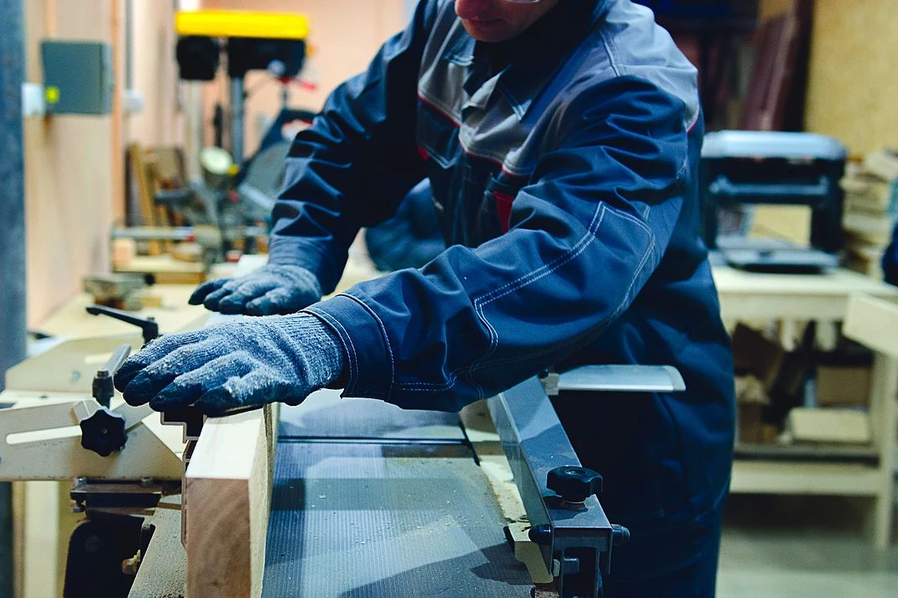

### Первый в Хабаровске ремесленный коворкинг

Мастерская открылась в январе 2016 года силами её основателя и руководителя Ивана Смирнова.

Просторное помещение и наличие достаточного количества рабочих поверхностей позволяет работать с заготовками больших размеров.

Работа в коворкинге возможна по дневному (от 1 часа), 2-х недельному (от 10 до 30 часов) и месячному абонементу. Месячный абонемент мастера позволяет хранить свои материалы и заготовки на время его действия, а также предусмотрен ночной абонемент для тех, кто любит творить в тишине.

В мастерской представлен широкий ассортимент деревообрабатывающего оборудования, в том числе:

- токарный станок
- распиловочный станок
- большой реймусовый станок «Металлург»
- торцовочная пила
- рейсмус JET
- сверлильный станок
- и множество ручного электроинструмента и столярных приспособлений

На регулярной основе проводится курс «Основы столярного дела», планируются также курсы по работе с ручным фрезером, резьбе по дереву и более глубокое погружение в классическую столярку. Также можно приобрести сертификаты на  разовые мастер-классы, например, по изготовлению подставки для смартфона, торцевой разделочной доски или деревянной посуды.

Мастерская принимает заказы на изготовление изделий не только из дерева, но и из бетона, которые изготавливаются по технологии вибролитья.

В собственном магазине мастерская продаёт готовые торцевые разделочные доски, садовую утварь и различные виды бетонной плитки.

---

Столярный коворкинг «Самоделкин», или Как хабаровчане нашли незанятую бизнес-нишу

[20 апреля, 2017](https://habinfo.ru/delo-bylo-vecherom-kak-habarovchane-nashli-nezanyatuyu-biznes-nishu/)

Создатель первого в городе столярного коворкинга «Самоделкин» Иван Удовенко поделился секретами притягательности «уроков труда» и перспективами реализованной с партнерами бизнес-идеи.

Коворкинг в широком смысле – это оборудованное всем необходимым для работы пространство, сдаваемое в аренду любому желающему на необходимый срок – день, неделю, месяц, несколько месяцев. Именно так организована работа в «Самоделкине». В арендованном помещении бывшего завода в районе МЖК собрано практически все, что нужно столяру: станки, ручной инструмент и, конечно, дерево. Это и есть столярный коворкинг, который работает уже больше года. А руководитель мастерской Иван Удовенко не только наблюдает за работой учеников, но и дает новичкам полезные советы.

### – Иван, как пришла идея такого необычного бизнеса?

– Вообще, это не только моя задумка. Как говорится, сидели мы с друзьями. Дело было вечером, делать было нечего. Мы искали то, чего нет в Хабаровске. В этом мозговом штурме и стало очевидно, что столярных мастерских в городе много, но прийти и научиться делать что-то самому некуда. Сначала, кстати, мы и задумывали открыть столярную мастерскую, а уже потом эта идея переросла в коворкинг.

### – У вас здесь много самого разного оборудования. Сколько стоили эти станки и где их найти?

– Найти нужные станки не сложно, некоторые мы покупали прямо в Хабаровске. Ключевой момент здесь – финансирование. Только техника обошлась нам больше чем в миллион рублей.

### – А с какой древесиной работаете вы и ваши ученики?

– Главное наше отличие в том, что мы сделали ставку на цельную древесину: то есть никаких панелей мдф и прочего у нас не найти. Доски закупаем и у нас в Хабаровске: сосну, дуб, ясень, ель. А из западной части России привозим ценные сорта древесины: амарант, венге. Если получается, то покупаем цельные спилы, которые остаются у Горзеленстроя после санитарных вырубок в городе. У нас есть светильник, например, сделанный из дерева, которое росло на улице Калинина.

### – Где брали капитал?

– У нас были свои вложения, а затем получили несколько грантов от министерства молодежной политики и спорта, от минпрома. Мы же не только учим людей столярному делу, но и участвуем в городских мероприятиях: например, устраиваем мастер-классы на выставках, изготавливаем скворечники и кормушки для зимних экологических акций. Работали с нами и урбанисты: скамейку-пианино, установленную в сквере около гостиницы «Интурист» делали мы. Совсем скоро во время общегородского субботника наши мастера будут устанавливать лавочки на площади Серышева. В скором времени запустим и уроки для детей: будем учить их работать по дереву с ручным инструментом.

### – Вообще, все это похоже на школьные уроки труда. «Скучают» ли хабаровчане по такому ручной работе?

– Спрос на обучение столярному делу есть, хоть и не такой как нам бы хотелось. Ведь мебель из экологически чистого сырья – это особое тепло, уют. А если сделать ее самому, то и в качестве сомневаться не придется. Среди наших клиентов есть и те, кто владеет столярным мастерством. Такие люди могут арендовать у нас место и все оборудование. Причем недельный абонемент никак не ограничивает время работы в мастерской: работай у нас хоть целый рабочий день. А мастера всегда с радостью помогут и подскажут, если это нужно.

В группы по обучению приходят как молодые люди, так и девушки. Причем, замечу, иногда у представительниц прекрасного пола получается изысканнее и аккуратнее: сразу заметно внимание к деталям и эстетике. А год назад был вообще интересный случай. К нам на курсы пришла семейная пара. За три недели они оба научились столярному делу и затем открыли свое предприятие. Получается, что у нас тут еще и бизнес-инкубатор!
