Турне по московским мастерским продолжается. На этот раз мы заглянем в "DIY Академию" — светлую и гостеприимную столярную мастерскую, разместившуюся на территории дизайн-завода "Флакон". Найти это место несложно: от центрального входа с Большой Новодмитровской улицы нужно просто идти прямо. Пройти насквозь главный корпус завода и нырнуть через ворота слева в небольшой ремесленный переулок. Здесь есть и типография высокой печати, и мастерские по работе с камнем, кожей, даже металлом, а за работу с деревом здесь отвечает общественная столярная мастерская "DIY Академия".

> "Здесь каждый может научиться столярному делу, послушать лекции о дизайне, поработать в коворкинге, присоединиться к культурным и социально значимым проектам"

— так они сообщают о себе [на своем сайте](http://diy-academy.ru/).  Ну что ж, проверим.

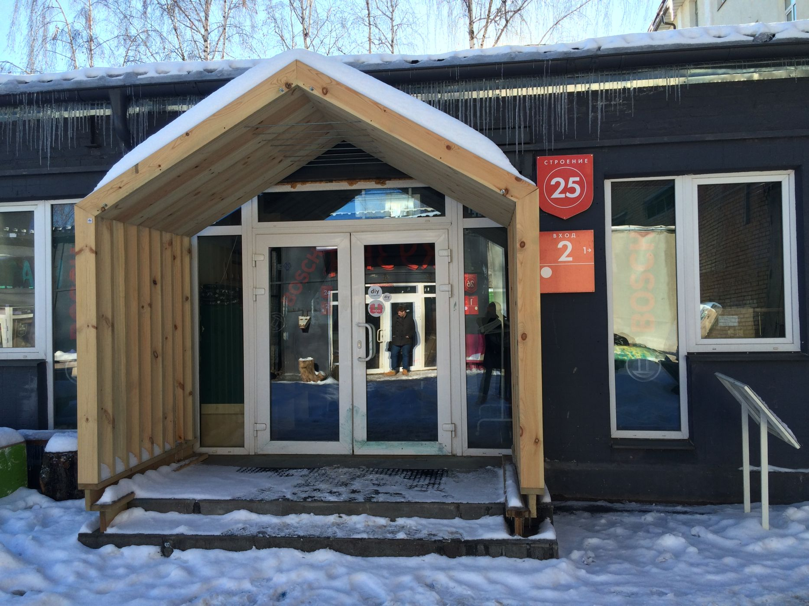
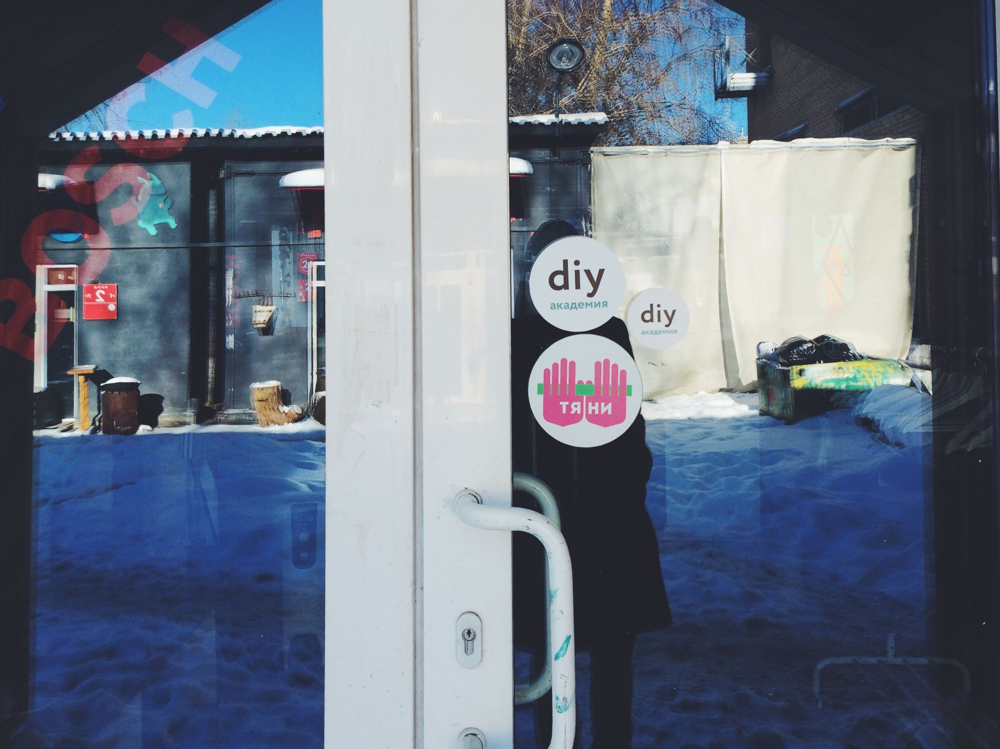

"Академия" открыта каждый день **с 12 до 20**. Перед посещением лучше всего предупредить ребят по телефону, но мы нагрянули без особенных предупреждений. Во вторник днём мастерская была совсем свободна и нам удалось подробно и в деталях познакомиться с её возможностями благодаря Климу, администратору.

Просуществовав более трёх лет в виде [сообщества на Фейсбуке](https://www.facebook.com/diyacademy), Академия "Do It Yourself" решилась выйти в оффлайн и открылась **в августе 2014 года** как совместный проект команды известного дизайнера и художника Вячеслава Швайкова и компании BOSCH. Компания выступила в качестве спонсора, предоставив проекту помещение и полную линейку инструментов "зеленой серии". Такое сотрудничество позволило не пытаться втиснуть мастерскую в тесные рамки коммерческой выгоды и создать действительно открытое творческое пространство. Это сотрудничество определило и основное направление: популяризация самостоятельного творчества в среде далёких от ручного труда людей. Очень правильное дело!

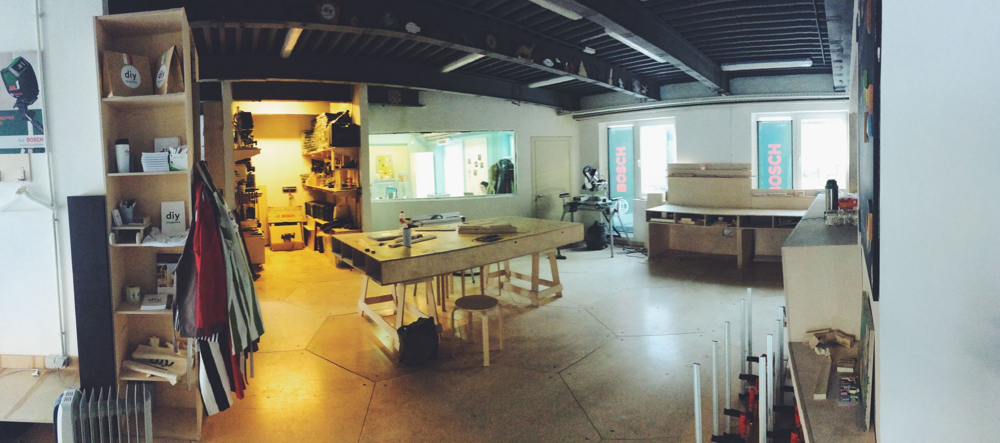

Открывшись совсем недавно, "DIY Академия" уже успела выработать ясные принципы работы с людьми, заинтересованными в столярном деле, но слабо представляющими себе даже самые его основы. **Придумать свой проект**, пускай даже в общих чертах или копируя идеи, найденные в Интернете — верный способ начать движение в этом направлении. Пришлите эскизы команде мастерской, выскажите свои идеи администратору и ребята помогут полностью сформулировать задачу, разбить её на этапы, рассчитать необходимое количество материалов и определиться с инструментарием. Мастера "Академии" подробно расскажут о тонкостях работы и обучат безопасному и эффективному использованию инструмента.

Время работы в мастерской рассчитывается **сессиями по 3 часа**, которые здесь считают оптимальными для достаточного погружения в дело и получения конкретных результатов без чрезмерного напряжения и связанных с ним невнимательности и неосторожности. Идея такого столярного "академического часа" отлично показывает себя на практике и большинство посетителей мастерской работает здесь именно на таких условиях. Недоиспользованное время можно доработать позже, а небольшие превышения не станут поводом вас выгонять. Однако для тех, кто хотел бы проводить в мастерской больше времени предусмотрены **месячные абонементы**. Для тех, кто хотел бы попробовать себя в работе с деревом, но так и не придумал, что бы хотел сделать, команда мастерской может предложить некоторые типовые проекты. А для полного погружения в тематику здесь регулярно проводятся **Курсы столярного мастерства** (КСМ), где за 8 занятий посетители получают возможность сделать свои проекты под чутким руководством мастеров и изучить все основные стадии работы с деревом, все основные инструменты и процессы столярного мастерства.

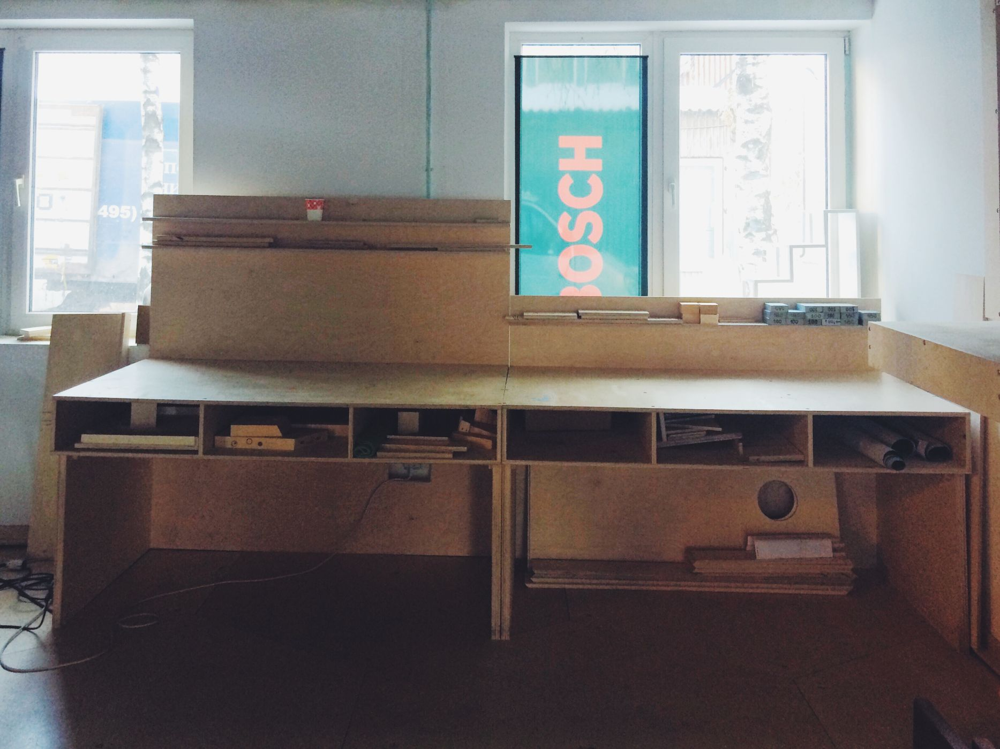
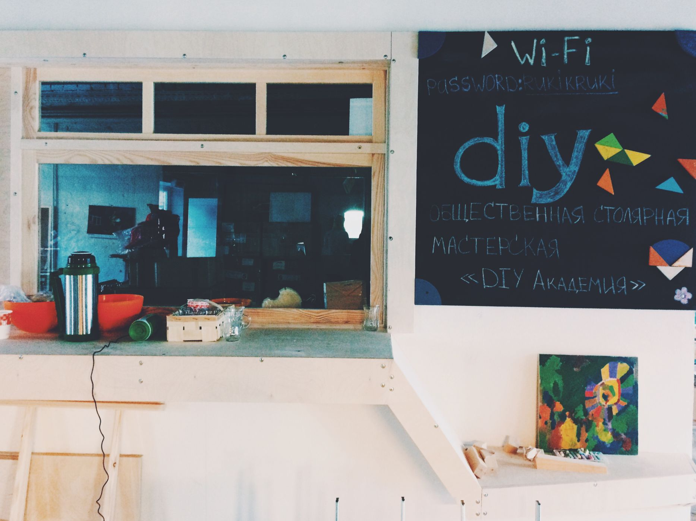
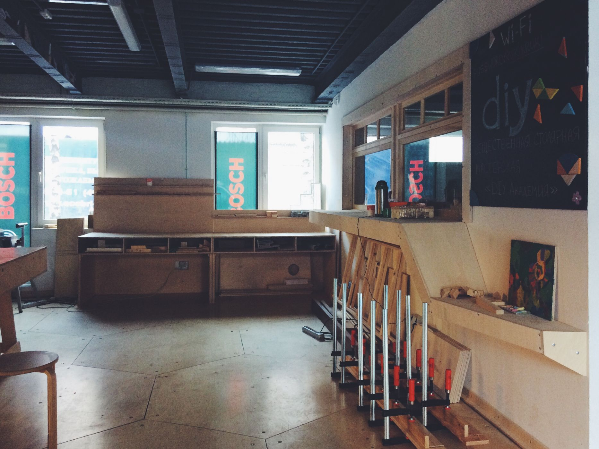
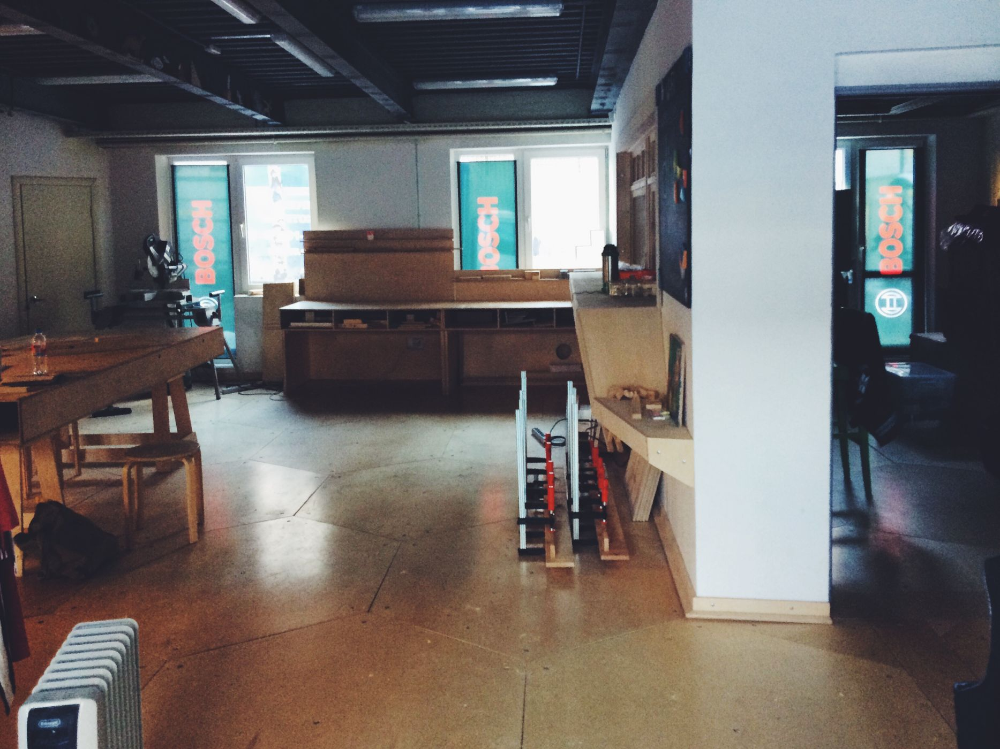
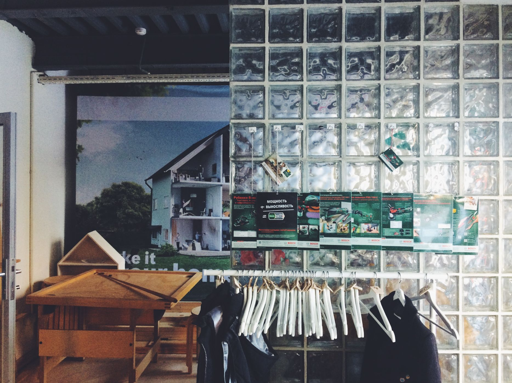

Войдя внутрь мы оказываемся в просторном помещении, поделенном на несколько функциональных зон: прихожая с вешалками для верхней одежды, небольшой уголок для отдыха справа, отделенный стенкой с окнами офис для сотрудников. Слева за стойкой с материалами есть большая ниша со стеллажами для инструмента и уголок для работы с красками и лаками. Основная рабочая зона мастерской — большое светлое помещение с несколькими верстаками и удобным доступом к стеллажам с инструментами и материалами. Здесь проходят различные творческие события, собирающие более 20—30 человек, но комфортно работать смогут **одновременно максимум человек 8—12**.  Неслучайно регулярно проводимые командой "Академии" курсы столярного мастерства (КСМ) рассчитаны на группы по 8 человек.

Рядом с прозрачной стенкой, отделяющей мастерскую от соседнего офиса компании, занимающейся 3D печатью, находится комната инструмента, где на двух стеллажах разместился **весь ассортимент "зеленой серии" инструмента для домашних мастеров** BOSCH. Это шуруповёрты, дрели, лобзики, циркулярные пилы, шлифмашинки, электрорубанки, фрезерные машины, клеевые пистолеты и фены, а также пара сверлильных станков и торцовочная пила. Там же на стеллажах можно найти все необходимые насадки, биты, шлифовальные круги, а также запас различных саморезов, клеев и прочих базовых расходников. Всё это доступно для использования: немножко можно взять бесплатно, если понадобится больше — отдадут по себестоимости.

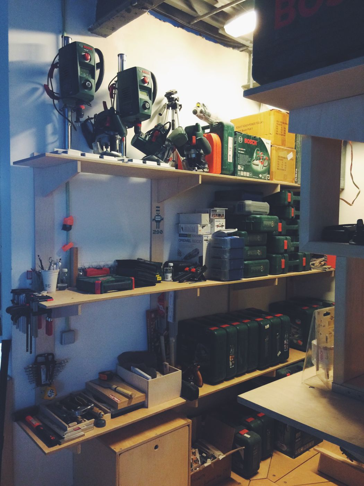
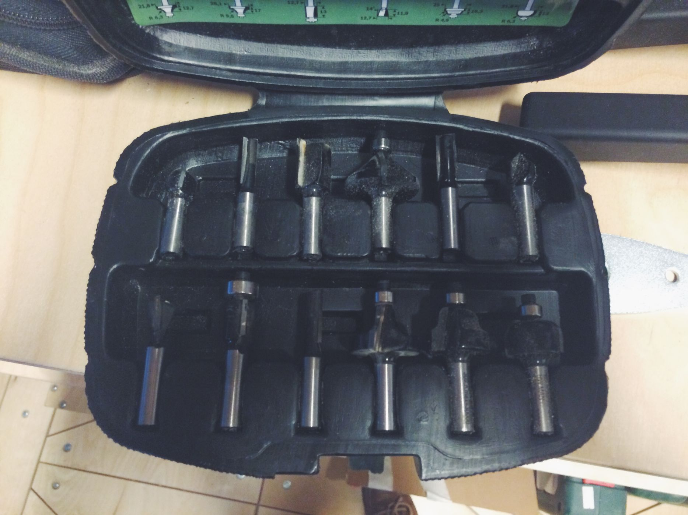

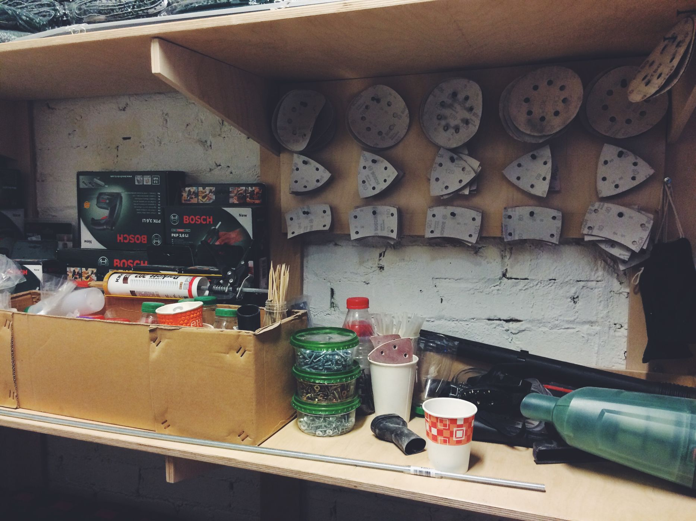

Точно также дело обстоит и с материалами: в основном это **хвойная и березовая влагостойкая ФСФ фанера** различной толщины. В "Академии" фанеру считают самым удобным и практичным материалом для овладения столярными навыками и не зря! Стабильный и предсказуемый материал позволяет не отвлекаться на тонкости его обработки и уделить внимание творческой самореализации. А универсальность фанеры ребята показали наглядно, собрав из нее практически все элементы интерьера, от стеллажей и больших верстаков до ст**о**ящего отдельного упоминания пола, выполненного из крупных кусков фанеры в форме шестигранных сот. Интерьер и мебель из фанеры смотрится лаконично и легко, а качество современных клеев позволяет забыть об опасениях выделения формальдегида. Практически вся современная фанера ФСФ соответствует классу эмиссии **E1** и безопасна для использования в помещении.

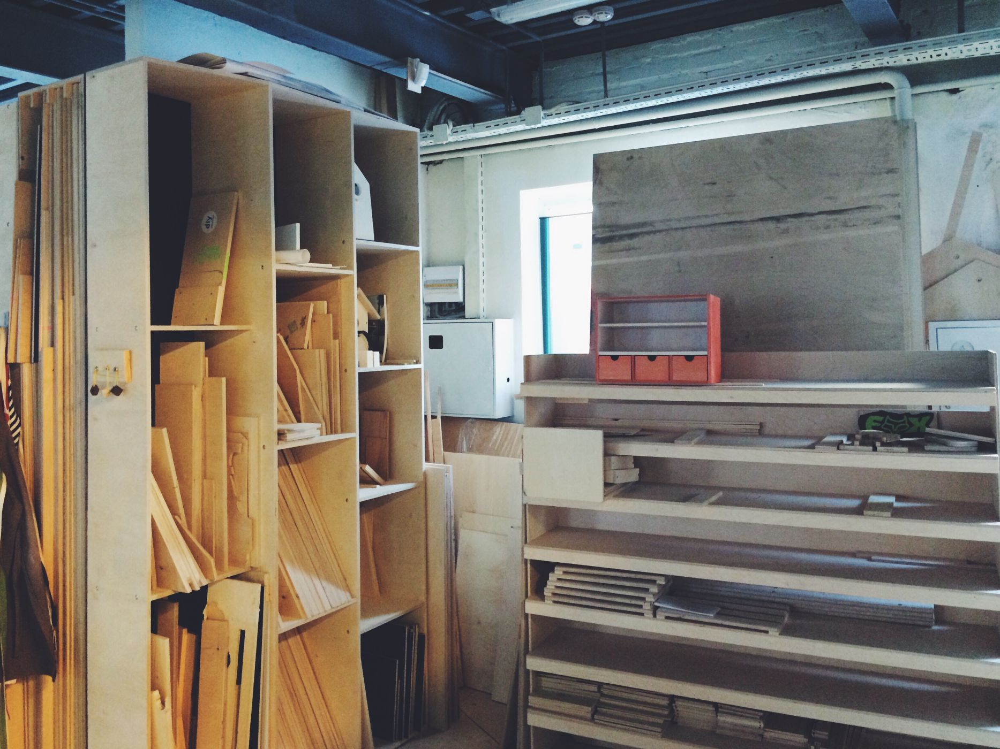
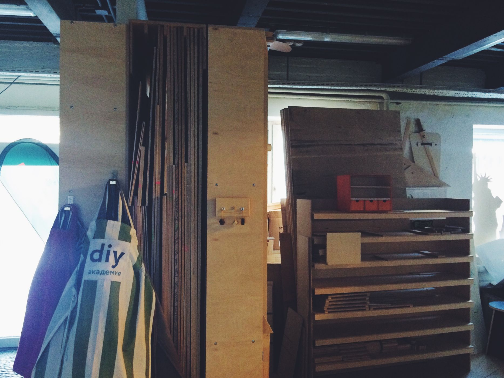
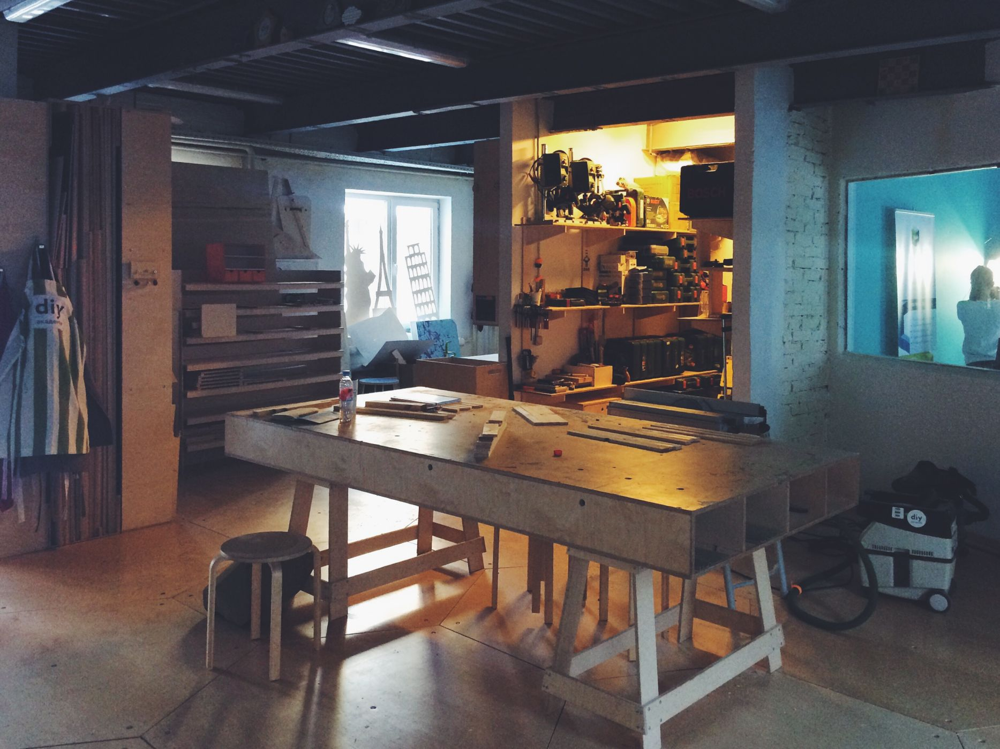

В "Академии" нет отдельного покрасочного помещения с вытяжкой, но это не составляет никаких проблем: команда мастерской использует только **водорастворимые акриловые краски и лаки**, лишённые всех недостатков алкидных и полиуретановых составов: они почти не пахнут, не выделяют вредных веществ и, к тому же, довольно быстро сохнут, создавая достаточно стойкие и красивые покрытия. Такими лаками покрыты все рабочие поверхности мастерской и даже пол, надёжно.

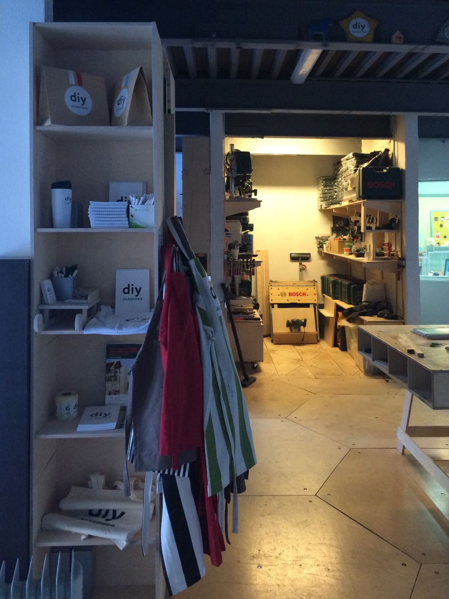

Общественная столярная мастерская "DIY Академия" — отличное место для первоначального знакомства с работой с деревом, а также для воплощения своих дизайн-проектов. Использование несложных инструментов "для домашнего мастера" открывает **доступ к самостоятельному творчеству для каждого и каждой**, кому хочется перейти от уже надоевшего потребления предметов к их созданию. Удачное расположение мастерской даёт уверенность в том, что "Академия" сможет многого добиться на пути популяризации самостоятельности и свободы самовыражения в созидательной деятельности.

[Тарифы и расположение мастерской здесь](/workshop/catalog/diy-academy/ "DIY академия") или на её официальном сайте.
