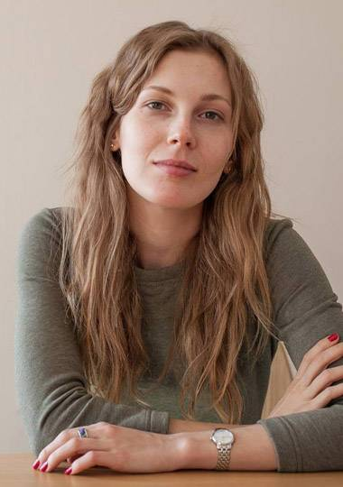
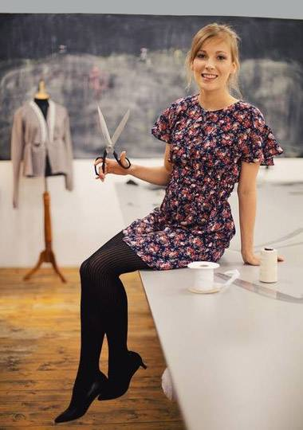
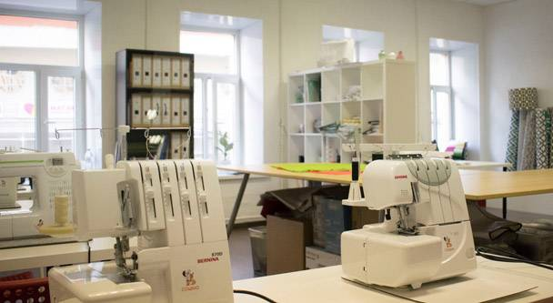
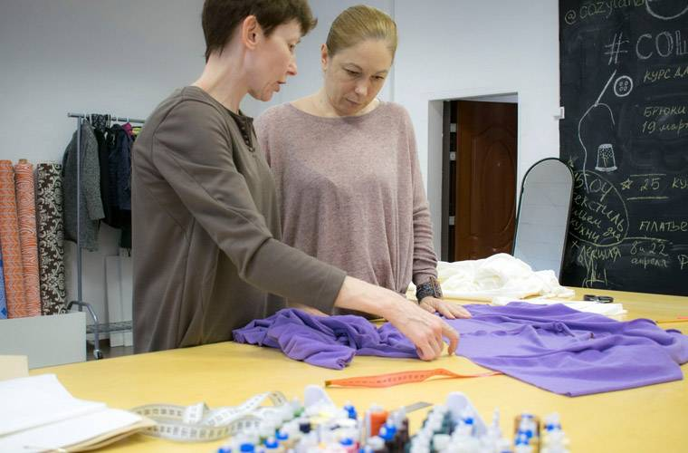
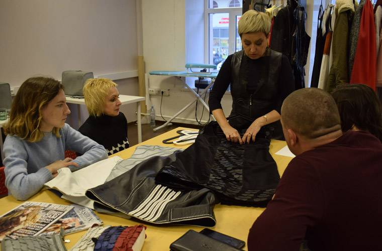

##### _Наталья Жутова - о том, как живёт и развивается её мастерская «Сошью»_

**Многие девушки и женщины рано или поздно хотят сшить что-то своими руками. Покупать для этого швейную машинку нецелесообразно - не всегда машинка в доме используется часто, к тому же она занимает место и требует обслуживания. Для начинающих и опытных швей, которым хочется поработать в новой обстановке, москвичка Наталья Жутова открыла коворкинг «Сошью» - сюда можно прийти и не только воспользоваться качественным оборудованием, но и проконсультироваться у специалиста. О том, как устроена открытая швейная мастерская, порталу Biz360.ru рассказала основатель проекта «Сошью» Наталья Жутова.**

#### Досье

**Наталья Жутова**, 26 лет, предприниматель из Москвы, основатель открытой швейной мастерской  **[«Сошью»](http://cosew.ru/)**. Образование: Российский государственный социальный университет, факультет журналистики. В 2016 году основала швейный коворкинг, вложив в проект около 250 тысяч рублей. Параллельно с развитием собственного проекта продолжает работать в онлайн-сервисе для организаторов мероприятий TimePad.

### **Как всё начиналось**

Мама Натальи Жутовой всю жизнь проработала в швейном производстве. Сама Наталья в детстве и юности всегда ходила в одежде, которую шили для неё «на заказ». Со временем ей тоже понравилось шить - и она пошла учиться в школу шитья. После её окончания поняла: тем, кто хочет дальше совершенствовать свои навыки в шитье, не хватает практики и знаний. А получить дополнительную информацию людям после швейной школы сложно.

В апреле 2016 года Наталья проходила трёхмесячный курс по открытию и развитию бизнеса в онлайн-школе городских предпринимателей Vector. Там и возникла идея создать пространство для швей, где они могли бы заниматься любимым делом и учиться чему-то новому. По сути, речь шла о коворкинге, в котором было бы необходимое для шитья оборудование и консультанты.

«У большинства из начинающих швей не было таких наставников, какие были у меня. Сейчас очень много людей приходит к нам во время или после курсов шитья, чтобы уточнить какие-то детали по обработке изделий», - говорит Наталья.

Свой проект она решила назвать Cosew (в переводе с английского – «шить вместе»). Но его мало кто мог правильно произнести. Тогда Наталья сделала «кальку» на русский язык – так появилось название «Сошью». «Мама шутит, что название выбрали, потому что в детстве я всё время её просила: «Мама, сошей мне что-нибудь», - вспоминает Наталья.

### **Перемена мест**

Для создания коворкинга требовалось просторное светлое помещение, соответствующее целому ряду требований. Но найти его оказалось не так просто.

Первое помещение мастерской находилось на территории дизайн-завода «Флакон» в районе метро «Дмитровская». Оно было очень небольшим и представляло собой не совсем то, что в идеале хотела видеть Наталья. Чтобы привести его в приемлемый вид, потребовался серьёзный ремонт, на который ушёл месяц. Помимо прочего, нужно было заново провести систему освещения - «общего» света в помещении не было.

Не способствовал удобству и бетонный пол. Его очень сложно убирать, и каждая упавшая на него вещь, особенно из деликатного белого материала, моментально становится грязной. Также добавляла проблем строительная пыль - в другой части помещения, не принадлежавшей мастерской, постоянно шёл ремонт.

Коворкинг «Сошью» открылся в июне 2016 года. Его оборудование включало в себя четыре швейные машины Bernina, два оверлока, парогенератор и доску для глажки белья. Скромные размеры помещения не позволяли даже поставить раскройный стол.

Начальные вложения составили примерно 250 000 рублей собственных средств. Они пошли на аренду, ремонт, закупку оборудования. Размер вложений превысил ожидания из-за не самого удачного выбора места и необходимости его переоборудования.

Но уже осенью коворкинг переехал в новое помещение. Его предложили Наталье знакомые - как временный вариант. Новая площадка тоже была меньше, чем требовалось. Но теперь предпринимательница могла в относительно спокойных условиях заняться поиском подходящего для коворкинга пространства.

### **Новая площадка**

Наконец, в марте 2017 года мастерская «Сошью» переехала в своё нынешнее помещение на Бакунинской улице - в районе станций метро Бауманская и Электрозаводская. Коворкинг делит пространство с шоурумом американских интерьерных тканей. Общая площадь студии – 48 квадратных метров, большую часть из которых занимает «Сошью».

Аренда обходится мастерской в 30 000 рублей в месяц. Также к основным расходам проекта относится зарплата преподавателей и реклама. В сумме они составляют около 45 000 рублей в месяц.

«Арендовать большое пространство не составляет большой проблемы. Но найти большое и подходящее нам по экономике помещение было действительно сложно», - рассуждает Наталья Жутова.

Пространство коворкинга рассчитано для комфортной работы пяти-шести человек одновременно. Если кому-то из арендаторов не нужна швейная машинка, то в одно и то же время здесь могут трудиться семь человек. В будни места арендуют три-четыре человека одновременно, в выходные иногда бывают заняты все места.

Чтобы арендовать рабочее место в мастерской «Сошью», нужно позвонить или оставить заявку на сайте. Записью и составлением расписания занимается сама Наталья. Всего коворкинг посещает около 100 человек в месяц.

### **От машин до булавок**

Мастерская «Сошью» предоставляет своим гостям пять швейных машин и распошивальную (плоскошовную) машину, которая используется при работе со швами и краями трикотажных изделий. Дома она мало у кого есть, её наличие в мастерской – это возможность придать вещам лучший вид и качество. Также к услугам посетителей коворкинга раскройный стол, парогенераторы и весь необходимый «ручной» инструмент – от ножниц до булавок.

Работая в небольших помещениях, Наталья Жутова сменила три марки оборудования, но у каждой из них были очевидные недостатки. Сейчас в коворкинге стоят машины марки Astralux.

«Мне нужно оборудование, которое одинаково хорошо работает с разными тканями. А диапазон возможностей предыдущих марок меня огорчал. То тонкие ткани плохо шились, то толстые не подлезали под лапку. С Astralux таких проблем нет», - замечает владелица «Сошью».

Машины, которыми оборудована мастерская – не промышленные, а бытовые, но при этом  достаточно «выносливые» и с широким для этого класса диапазоном возможностей. Для основательницы проекта это – осознанный выбор, и дело здесь далеко не только в цене. Промышленные машины, как правило, нацелены на то, чтобы быстро отшивать прямой строчкой в условиях производства. К тому же с таким оборудованием не каждый может справиться. А с бытовыми машинами работать гораздо легче, и у них шире спектр возможностей.

### **Цена вопроса**

В коворкинг приходят люди с разным уровнем швейного мастерства, и задачи у них разные. Кто-то шьёт профессионально на заказ и нуждается в недорогой производственной базе. Некоторые приходят сшить какую-нибудь вещь для себя, и им нужна помощь специалиста. Начинающих и опытных мастеров среди посетительниц примерно поровну.

«Сейчас швейные коворкинги постепенно начинают появляться. Но такой атмосферы и охвата как у нас, я пока не вижу ни у кого. У нас семейный бизнес, нам комфортно и уютно работать. Наверное, поэтому и люди к нам возвращаются. Среди посетителей много тех, кто побывал у нас не менее трёх-четырёх раз, - делится своими наблюдениями Наталья.

Разовое посещение коворкинга стоит 900 рублей. По времени оно не ограничено и позволяет работать хоть целый день (с 11.00 до 22.00, кроме понедельника). Посещение включает в себя пользование оборудованием и аксессуарами (ножницы, линейки, мелки и т.д.), а также консультации мастера-технолога. Разовые посещения покупают как начинающие швеи (чтобы попробовать), так и опытные, для решения несложных задач или примерок.

Абонемент на пять посещений действует 45 дней и стоит 3000 рублей. Им, как правило, пользуются начинающие швеи, а также дизайнеры или другие посетители со сложными изделиями, которые не сшить за один раз. В стоимость длительных абонементов также входит хранение вещей и выделенное или закреплённое рабочее место (возможность работать каждый раз на одной и той же выбранной машинке).

Безлимитное посещение студии можно оформить за 4500 рублей в месяц. Правда, этот абонемент не включает посещение в выходные дни. Им обычно пользуются профессиональные швеи, чтобы сменить обстановку, поработав в новой для себя мастерской.

Абонементы студии можно купить друзьям в подарок. Таких продаж в последние месяцы было уже немало. В подарочных абонементах не указана дата открытия, их активируют при первом посещении.

Консультации специалиста входят в любой формат аренды рабочего места. Но те, кто хочет более детально узнать интересные для себя моменты, могут заказать индивидуальное занятие с преподавателем. Стоимость этой услуги – 1000 рублей в час.

Для желающих научиться чему-то новому проводятся мастер-классы. Один из них, «Введение в швейное мастерство», предназначен для новичков. На этом занятии учат снимать мерки, работать на машинке, разбираться в терминологии. Мастер-класс «Оверлок и трикотаж» посвящен работе на этой машине и различным видам швов. Результат занятия – самостоятельно сшитая футболка. Ещё один мастер-класс обучает шитью по готовым выкройкам и основам моделирования базовых выкроек.

Каждый мастер-класс проводится по два-три раза в неделю и продолжается 3-3,5 часа. Стоимость участия в нём – от 1900 до 2500 рублей. Мастер-классы посещают, как правило, три-четыре человека.

Также в коворкинге можно заказать индивидуальный пошив изделия по своим меркам. «В частном порядке» отшивают платья из сложных тканей, брюки на подкладе, верхнюю одежду. Большинство заказчиков – арендаторы или посетители мастер-классов, уверенные в высоком уровне мастеров. Пошив платья обойдётся заказчику в сумму от 3500 рублей, брюк – от 3000, пальто – от 5000 рублей.

### **Маркетинг и продвижение**

Продвижением Наталья стала заниматься с момента запуска мастерской. Новость об открытии коворкинга «Сошью» опубликовала на своём сайте школа бизнеса Vector, также эту новость расшарили друзья Натальи в Facebook. В тот период проблема была в том, что швейных коворкингов ещё не было, и подобный формат никто не искал.

«Нашей задачей было рассказать, что появился новый формат сервиса для желающих шить. Я начинала с того, что просила рассказывать про нас в школах шитья, с которыми была знакома. Сложно было донести, кто мы такие, чем занимаемся, и почему к нам надо прийти», - вспоминает Наталья Жутова.

Сейчас основные каналы продвижения студии – [сайт](http://cosew.ru/) и [страница проекта](https://www.facebook.com/pg/cosewmoscow/) в Facebook. По запросу «швейный коворкинг» в основных поисковиках Cosew.ru занимает первое место. Также сервис продвигается через партнёров. К ним относятся в первую очередь школы шитья. Время от времени используется кросс-промоушн: совместные акции с дружественными брендами.

Недавно завершился большой совместный проект с производителем швейных машинок Astralux. Для «образовательного» направления бренда – «Академии Astralux» - мастерская готовила видео-обзоры швейных машинок и фото-мастер-классы по шитью изделий.  Иногда совместно со своим соседом по студии, шоу-румом тканей, коворкинг устраивает мастер-классы по интерьерным вещам из тканей.

Немало клиентов приходит и по рекомендациям. «О нас рассказывают подругам и знакомым, девушки нередко дарят друг другу подарочные сертификаты на день рождения или другие праздники. Сейчас уже бывает, что мужья отправляют к нам жён – видят нас по каким-то каналам, и покупают жене билет в подарок», - рассказывает основательница «Сошью».

### **Что дальше**

Сейчас в проекте три постоянных сотрудника. Старшим преподавателем является мама Натальи, Елена Жутова, технолог с 20-летним опытом работы. Жанна Александренко преподает пэчворк (лоскутное шитьё). Её нашли через публикацию на Quiltfest -международном фестивале лоскутного шитья. Сама Наталья занимается всеми административными и финансовыми вопросами, рекламой и сайтом, ведёт странички в соцсетях.

В ближайших планах коворкинга – появление мини-курсов. Они будут посвящены вещам, которые невозможно сшить за один мастер-класс - юбкам, платьям-футлярам и т.д. Есть мысли и о проведении лекций на интересующие посетительниц «швейные» темы.

Динамикой развития проекта Наталья Жутова довольна. За пять месяцев (с февраля по июнь 2017 года) оборот коворкинга вырос в два раза. Средства, потраченные на закупку оборудования, уже удалось окупить.

«О нас узнают всё больше, советуют друзьям, покупают абонементы в подарок. Надеюсь, что скоро мы перестанем вмещать всех желающих. В таком случае придётся задуматься о новом расширении», - говорит Наталья.

[Оригинал статьи на сайте biz360.ru](https://biz360.ru/materials/mesto-chtoby-shit-kak-ustroen-shveynyy-kovorking/)
